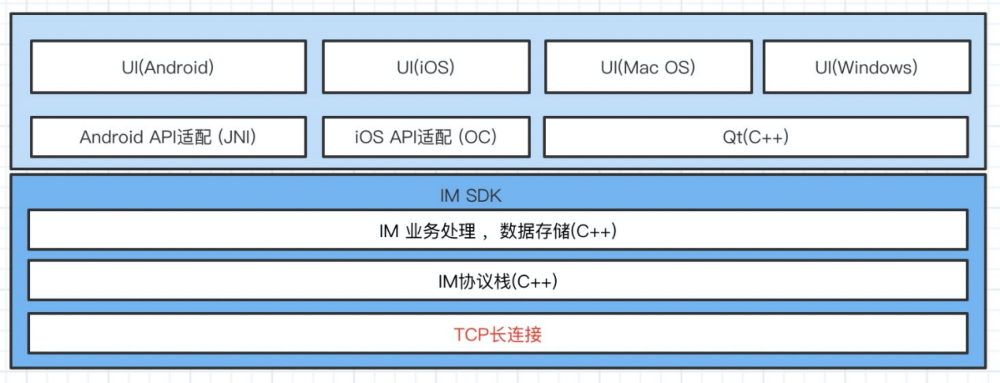
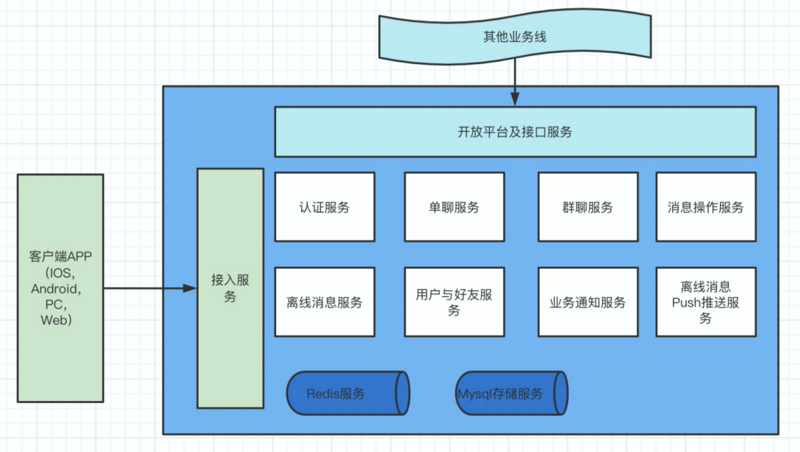
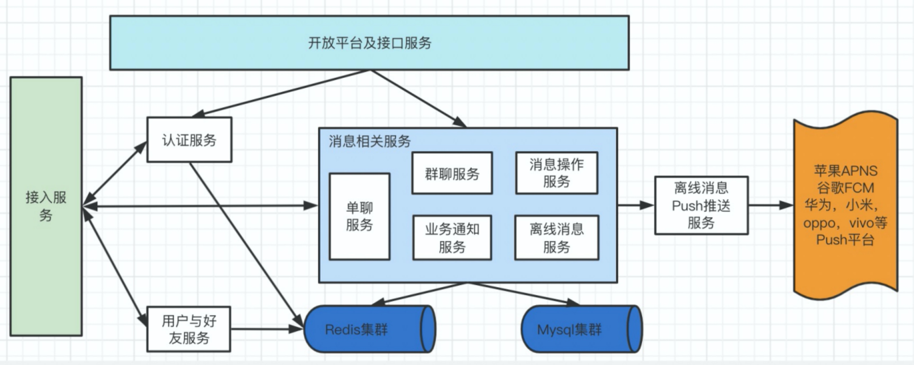
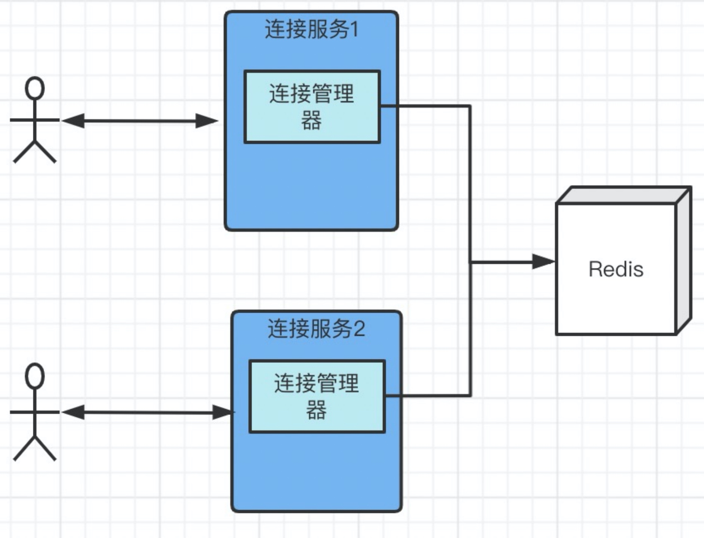
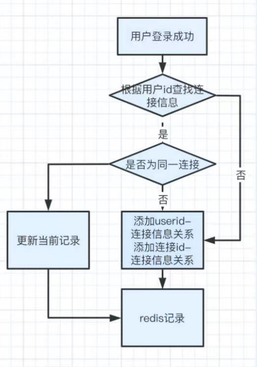
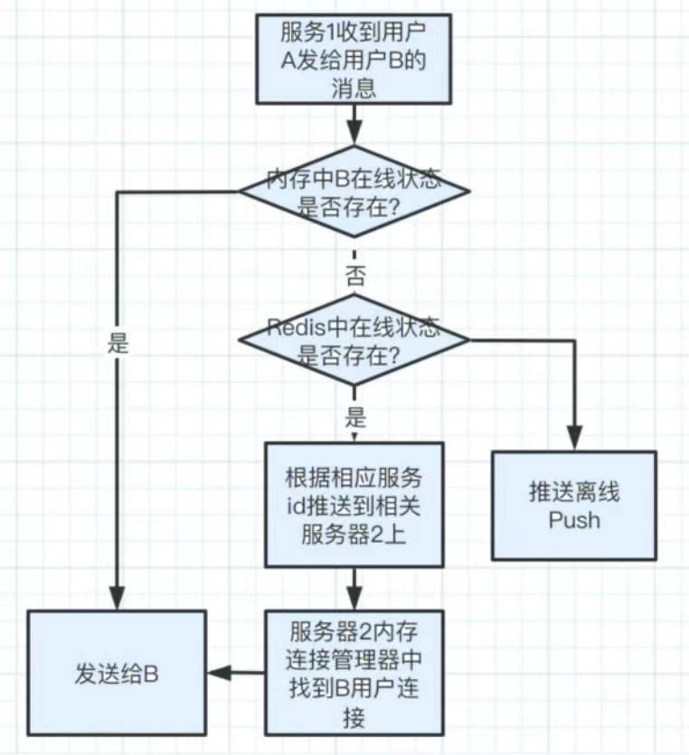
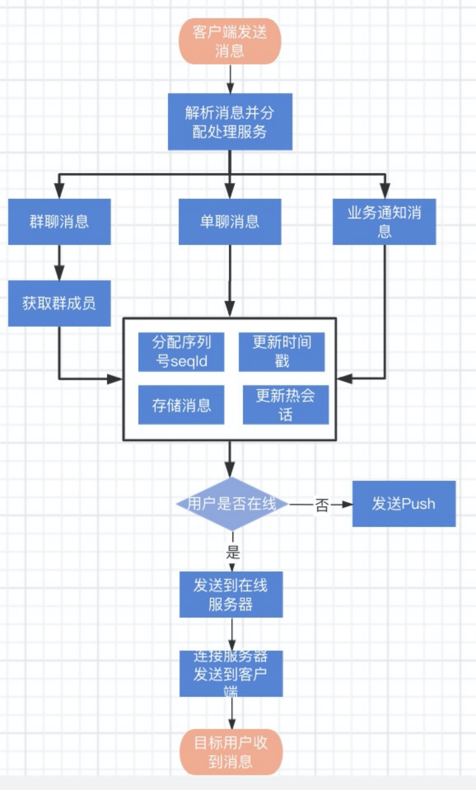
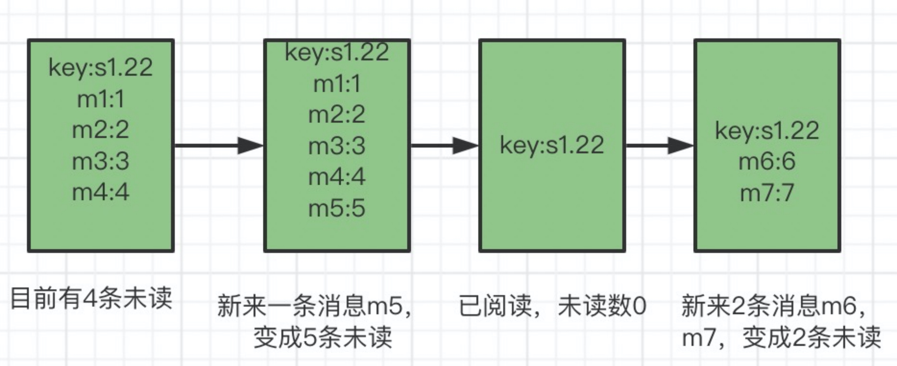

# 1-基础篇 基于Tars高并发IM系统的设计与实现
## 作者简介
    兰怀玉 
    毕业于中央民族大学计算机专业
    先后供职国内外多家公司软件研发设计岗位，有丰富的软件研发经验。
    从事IM领域设计研发十余年，先后领衔多个IM通讯系统设计与研发发，拥有丰富的IM系统设计研发经验。
    
## 综述
&emsp;&emsp;我曾经做过一个比喻，IM(即时通信)系统好比发动机，是一个系统的核心。
&emsp;&emsp;我国在导弹领域能够独立自主，而且很厉害，但是在飞机方面一直受制于人；为什么？ 
因为要求不同，火箭发动机属于一次性产品，不可重复利用，只要把火箭送上天使命就完成了；飞机则不同，飞机对发动机的要求比火箭高很多，要既能飞出去，还能飞回来，重复使用不能出故障。 

&emsp;&emsp;所以能做好火箭发动机不一定能做好飞机发动机，飞机发动机要像火箭发动机那样会出人命的。 

&emsp;&emsp;同样的道理，你研发一款低频使用系统和高频使用的系统对技术的要求也不一样。 

&emsp;&emsp;IM是一个要求很高的高频低延时系统，要求越高，研发门槛自然就越高； 
&emsp;&emsp;现在我就IM的技术，带领大家一探究竟。

&emsp;&emsp;后续将内容分基础篇，进阶篇，实战篇三部分逐步刨析IM设计实现。
## 基础篇
## IM简介
### IM定义
&emsp;&emsp;InstantMessaging 即时通讯、实时传讯，能以最快的速度把信息从一方传递到另外一方。
&emsp;&emsp;即时通信系统（IM，Instant Messenger）是一款跨平台（Linux Server，Windows Server），可定制的 P2P 即时通信系统（集成多人视频会议功能），为各行业门户网站和企事业单位提供“一站式”定制解决方案，打造一个稳定，安全，高效，可扩展的即时通信系统.(来自百度百科）
### IM软件
* ICQ
* 腾讯QQ
* 微信
* 易信
* 钉钉
* 飞书
* 百度HI
* 飞信
* 阿里旺旺
* Skype
* Google Talk
* Whatsapp等 
### IM发展历程
* 第一款即时通讯的诞生
随着互联网的发展，人们迫切地需要一个在线聊天系统，以解决工作中遇到的一些问题。
1973年，Doug Brown 和 David R. Woolley在伊利诺伊大学的柏拉图系统上创建了Talkomatic，它是世界上第一款即时通讯系统。
Talkomatic提供了六个频道，每个频道允许最多五名用户在线聊天，后来这一系统被应用在世界上第一个网络论坛PLATO Notes上，直到上世纪80年代，这个论坛才逐渐消失在人们的视野中。
Talkomatic的信息发送方式，与如今的QQ、微信等即时通讯软件不同。我们使用微信进行交流时，需要先将文本消息打出来，再点击“发送”按钮，对方才能看到消息。而Talkomatic却是实时的，发送方每键入一个字，接收方能立即收到。
你可能以为这么古老的东西，应该早就经消失了吧？然而，就是这么一款远古级的东西，在2018年还发布了第4个版本，以支持更多种类的现代浏览器和显示分辨率.
随着互联网的发展，即时通讯软件开始出现。其中由三个以色列青年开发的ICQ最为出名，它是世界上第一款即时通讯软件。
 	ICQ一经推出，在短短6个月的时间，便成为当时世界上用户量最大的即时通讯软件，即便在当时互联网比较不发达的亚洲，市场占有量也超过了70%。
1998年，ICQ用户量达到1200万，被AOL看中，以2.87亿美元收购。
* QQ
几乎与此同时，身在中国的马化腾，看到了即时通讯的巨大商业价值，将为寻呼台建立网上寻呼系统的主要业务，变更为开发即时通讯工具——OICQ。
就在OICQ席卷中国即时通讯市场之时，ICQ母公司美国在线起诉腾讯侵权，这才有了后来大名鼎鼎的腾讯QQ。

* 移动IM
手机等移动设备的普及迎来即时通讯软件发展的第二春，各个国家均派生出不同的即时通讯软件，例如美国的Whatsapp、日本的LINE、韩国的Kakao Tall，以及中国的米聊，微信。
* 广义IM
现在即时通讯与近代即时通讯的不同之处，在于领域更加细分化。既有面向个人的即时通讯工具，也出现了企业级即时通讯工具。
与个人不同，企业级即时通讯软件更强调安全性、实用性、稳定性和扩展性，有的企业级即时通讯软件还支持定制，极大提高了企业内部的沟通效率。
即时通讯软件的发展，仅仅是互联网信息洪流中的一个产物，但其从诞生到兴盛，也经历了漫长的五十多年的发展，如今即时通讯已经成为人们工作和生活的一部分。
### IM对技术的要求
说起IM，每个人的理解都不通，有些说不就是个即时通讯吗，很简单；也有人说IM对技术要求很高，很不容易。 
这两种说法都没错，只是观察角度和要求不同。 
持前一种说法的人，要么就是扫地僧水平的高手，要么就是一个新入行的新手，只是开发一个demo而已。 
持后一种说法的人跟IM系统有个亲密接触，有一些这方面的经验，也遇到过一些棘手的问题。 

国内做IM最厉害的公司是腾讯，以IM起家，统治互联网流量数十年；在2011年前后也遇到过危机，就是移动互联网兴起的时候，国内雷军同学搞了个米聊当时很火，很快就拥有几百万用户，当用户上升到一定程度之后，米聊出现用户量暴涨导致宕机，服务不稳定等因素，最终导致腾讯的微信后来居上，一举超越奠定了今天微信移动互联网江湖的统治地位；当然微信的超越不仅仅是因为米聊宕机不稳定一个原因，但是这个不稳定也是很重要的一个因素；就好比两军对战时，你的导弹发射系统老出现问题，对方一定会抓住战机猛攻，如果不能快速恢复，对方攻击直至你最终战败.感兴趣的朋友可以再网上找找相关资料。

腾讯微信的快速发展，并且超越，用户高速增长，稳定服务跟腾讯在IM领域的长期积累密不可分，IM作为高频使用的系统对服务的稳定性非常敏感，有一点延迟或者不稳定用户都可以感受到，从而影响用户体验。 

### IM技术体系
经过多年IM系统开发设计工作，本人对IM的技术总结为一句话“IM技术一二三四五”；
具体如下:
* 一个通讯协议
* 两个架构
    * 客户端端
    * 服务端端
* 三大指标
    * 高可用
    * 高并发
    * 低延时
* 四大模块
    * 连接管理
    * 用户及好友管理
    * 消息管理
    * 离线推送
* 五大难题
    * 连接稳定
    * 消息一致性
    * 历史消息
    * 未读数
    * 超大群

后续篇章主要针对以上5个方面进行详细阐述，一步一步教您如何构建一个高并发IM系统。

## 一个通讯协议
#### 通信协议解释
通信协议是指双方实体完成通信或服务所必须遵循的规则和约定。
通过通信信道和设备互连起来的多个不同地理位置的数据通信系统，要使其能协同工作实现信息交换和资源共享，它们之间必须具有共同的语言。交流什么、怎样交流及何时交流，都必须遵循某种互相都能接受的规则。
这个规则就是通信协议。
#### IM通讯方式
IM系统需要把信息或者数据从A发给B，一般都有2种方式： 
##### 端对端方案
直接从A发给B。

图1 端对端方案

##### 服务器中转方案
A通过服务器S将信息发给B 

该特点主要有： 
* 服务稳定性依赖于S服务器的稳定性，而不是依赖于A，B
* 消息集中处理，存储更易维护监管
* B客户端不在线时，不影响消息A客户端消息发送 
* 可以存储查看历史消息 
* 消息时序，未读数计算，多端同步等更方便
当前市场上主流IM系统基本都采用此方案。

#### 通信协议要素
不管用前文中的方案1还是方案2，当消息A发送的到B时，都需要对方能识别，要做到识别就需要制定一通信协议来约束；

要确定IM通信协议，主要根据以下几个要点要素进行展开：
* 通讯方式
* 协议类型
* 协议结构及编码方式
* 协议包含的业务

#### 通讯方式 
常见的通讯方式主要分为TCP和UDP两种，两种方式各有千秋，都可以使用； 
* TCP是有连接的数据传输方式，能保证数据的可靠到达，开发者只需要做好业务逻辑即可； 

* UDP是无连接点对点发送数据，不能保证数据可靠到达，开发者需要自己进行数据可靠到达做相应的工作； 

&emsp;&emsp;为了减少前期工作的复杂程度和工作量，大多数都会选择用TCP进行通讯。 

&emsp;&emsp;TCP又分为长连接和短链接，IM系统为了能准时及时发送收取数据，基本都使用长连接； 
#### 协议类型 
&emsp;&emsp;主要有文本类型和二进制类型； 
&emsp;&emsp;文本类型协议主要载体就是普通文本进行描述和解析，比如HTTP协议； 
&emsp;&emsp;二进制协议以二进制形势进行描述和解析，比如MQTT、QQ，微信都是二进制协议； 

#### 协议结构及编码方式 
二进制协议一般都会将协议分为三部分，报文长度，协议头，协议体； 
字段|说明
---| ------
Length|	报文长度（包含本字段4字节）
Header|	报文头，所有控制报文都包含
Payload|	消息体，以报文头中定义的格式（json、xml、pb、tars）二进制传输

协议头包含数据包版本号，业务类型，唯一标识,协议体数据的编码方式等信息； 
协议体主要包含针对具体业务所包含的数据；
字段 |	长度|说明
----- | ------|-------
type|2字节|OMTP控制报文的类型，
version|2字节|OMTP控制报文的版本号，
flag|4字节| 详见下文flag说明
packId|16字节|报文Id，建议为UUID
 

#### 协议包含的业务 
IM协议的定义主要包含如下业务：
* 用户登录及身份认证 
* 退出登录 
* 用户被踢 
* 心跳
* 业务通知消息发送/响应
* 单聊消息发送/响应 
* 群聊消息发送/响应 
* 最新消息会话，未读数获取请求/响应 
* 历史消息获取/响应
* 数据同步请求/响应 
* 开始旁听会话请求/响应 
* 结束旁听会很请求/响应
* 群聊创建请求/响应
* 群聊解散请求/响应 
* 群聊加人请求/响应 
* 群聊减人请求/响应 
* 群聊名称，头像等修改请求/响应

以上是对协议要点进行简单表述，具体协议详见文章《OMTP协议说明文档》。

## 两个架构
主要指客户端架构跟服务端架构，针对这两个架构分别进行说明
### 客户端架构
架构方案概述
目前App的开发主要有如下四个方案：
* H5 方案 
* 纯原生方案 
* 跨平台SDK+原生UI交互 
* 跨平台SDK+跨平台UI交互 
以上4个方案各有千秋，下面逐一进行分析；
##### 方案一：H5 方案
该方案一般采用websocket长连接或者http短链接与IM服务端交互（具体交互细节此处不再赘述）。
此方案优缺点分析；
* 优点：是开发速度快，跨平台性好，一套代码各个平台都可以使用，升级方便；
* 缺点：依赖js引擎和浏览器渲染，H5+js做端链接低频应用勉强可以；对于IM这种高频大数据量的应用，加上js对于存储和本地资源访问的限制，后期对卡顿，加载慢，动画效果差等缺点没有好的方案来优化解决，大多数团队都会转到后面的3个方案上。
##### 方案二：纯原生方案
每个App端独立开发，实现各自的通讯，协议栈，数据存储，业务逻辑和UI交互；
优缺点分析；
* 优点：
  此方案利用每个操作系统的特性，在用户体验上很容易达到用户期望，也是使用较广的一个方案；
* 缺点：
    ios，android，windows，MacOS，Linux每个操作系统都一个团队来开发，所有业务逻辑和数据处理针对每个平台都需要实现一遍，浪费开发测试资源，从成本上来算不经济。

&emsp;&emsp;采用此方案没有技术障碍，如果选择的开发框架提供的组件库不能满足要求，还可以通过访问操作系统底层API来解决问题。
##### 方案三：跨平台SDK+原生UI交互
&emsp;&emsp;SDK负责实现通讯，协议栈，数据存储，业务逻辑；每个平台单独实现部分高频UI交互，比如登录，会话列表，单聊会话，群聊会话，会话设置等。
&emsp;&emsp;SDK一般用c/c++实现，跨平台性好，效率高，每个操作系统对c/c++的支持都很好，底层直接调用std标准库和操作系统API实现相应的功能需求；通过在各个平台进行交叉编译，实现一次代码，到处编译的状况。
&emsp;&emsp;此方案用户体验没问题，解决了方案二的人员浪费问题，底层通讯，协议栈，数据存储，业务逻辑在DK中实现，不用每个平台自己实现，节省不少人力资源。
* 客户端架构图

* 客户端SDK架构图

优缺点分析；
* 优点：用户体验最佳，团队成员减少。
* 缺点：对SDK开发人员要求门槛较高，需要熟悉C++语言及每个平台特性。

##### 方案四：跨平台SDK+跨平台UI交互；
此方案是对上一个方案三的局部优化。
SDK实现了底层通讯，数据，逻辑的统一化。
有些同学说了，既然底层通讯数据处理，业务逻辑可以做成跨平台SDK，那UI能不能也做成跨平台的，当然能了。
主要有如下跨平台UI可以选择：
###### Flutter
Flutter 是 Google推出并开源的移动应用开发框架，主打跨平台、高保真、高性能。
开发者可以通过 Dart语言开发 App，一套代码同时运行在 iOS 和 Android平台。 Flutter提供了丰富的组件、接口，开发者可以很快地为 Flutter添加 native扩展。
同时 Flutter还使用 Native引擎渲染视图，这无疑能为用户提供良好的体验。

Flutter属于新技术，在IM领域目前没有成熟先例，需要预研如下问题：
* 系统原生API的兼容性与支持，一些原生化问题要能解决，比如每个平台UI交互流畅和动画的支持，桌面图标角标，push提醒等
* 高频，大量数据刷新的性能；
* 长时间运行内存和性能是否能达到指标；
###### Qt
&emsp;&emsp;Qt是一个1991年由Qt Company开发的跨平台C++图形用户界面应用程序开发框架。它既可以开发GUI程序，也可用于开发非GUI程序，比如控制台工具和服务器。Qt是面向对象的框架，使用特殊的代码生成扩展（称为元对象编译器(Meta Object Compiler, moc)）以及一些宏，Qt很容易扩展，并且允许真正的组件编程。
&emsp;&emsp;针对windows，Mac 平台个人比较推荐使用Qt开发UI，技术成熟，性能好，既能满足Windows，Mac，也能够将来兼容UOS（Linux）；一套代码三个平台，爽否？

**通过以上分析，方案三和方案四无疑是较好的选择；
从投入产出比来看，如果方案四中Flutter能解决ABC问题属于最佳方案；具体情况各位同学可以根据自己团队实际情况来选择。**

### 服务端架构
&emsp;&emsp;服务端架构的发展到目前为止单体结构已被淘汰，以微服务架构为主流，IM服务端架构也不例外，采用微服务架构进行设计开发。 
&emsp;&emsp;目前开源的微服务架构有很多，比较适合IM服务开发个人推荐腾讯的Tars框架；毕竟站在巨人肩上，少走弯路；
本人使用Tars框架有将近7年，基础通讯能力很稳定，未出现大问题； 
#### Tars微服务架构 
* Tars是一款高性能、多语言的微服务治理框架。 
* TTars在腾讯内部名为TAF，内部从08年开始使用，到现在将近10个年头了，目前该框架在腾讯内部，有100多个业务、1.6多万台服务器上运行使用，服务内部使用TARS协议通讯。
* TTARS 协议采用接口描述语言(IDL)来支持多种编程语言，C++、Java、Node.JS、PHP、Python、Golang等，使不同平台、不同语言编写的程序能够相互通信交流，打破语言屏障。 
 
下文简要介绍其特点。 

#### TARS协议： 
&emsp;&emsp;采用接口描述语言（IDL）来实现，它是一种二进制、可扩展、支持多平台、多开发语言的协议， 主要应用在后台服务之间的RPC通信协议，以及对象的序列化和反序列化等方面。 

* 调用方式
通过定义服务提供的接口，自动生成客户端和服务端的相关通信代码，只需实现业务逻辑即可对外提供服务，服务间调用支持同步调用、异步调用和单向调用三种模式。 
* 负载均衡
框架通过名字服务来实现服务的注册与发现，客户端通过访问名字服务获取到被调服务的地址信息列表，并根据需要选择轮询、hash、权重等多种负载均衡方式来调用服务。 

* IDC/SET分组
为了减少网络资源消耗及网络故障带来的影响，框架提供了跨地区、跨机房、就近接入的IDC分组功能。为了方便对业务服务部署管理进行标准化和容量化，框架提供了互不干扰、故障隔离的Set部署能力。 

* 集中配置
对业务配置进行集中管理并且操作web化，使配置修改更容易，通知更及时，配置变更更安全，服务只需调用配置服务的接口即可获取到配置文件。 

* 容错保护
容错保护通过两种方式实现：名字服务排除和客户端主动屏蔽。名字服务将把连接失败的服务器从地址列表中去除。同时，客户端会把持续连接超时的服务器从地址列表去除。 

* 过载保护 
为了防止业务因为访问量突增或服务器故障造成系统整体的繁忙，进而导致全部服务的不可用，框架内部实现请求队列，服务调用通过非阻塞方式实现异步系统，从而达到提升系统处理能力的目的。 

* 消息染色 
框架提供了对某服务某接口的特定请求进行染色的能力，染色的消息可以透传到后面需要访问的所有服务上，使用者只需在染色服务器上即可分析请求访问的路径，方便跟踪定位问题。 

* 数据监控
为了更好反映和监控小到服务进程、大到业务的运行质量情况，框架提供了服务模块间调用信息统计、用户自定义属性数据、服务状态变更和异常信息上报的功能。 

Tars具体详见：https://tarscloud.org/ 

#### IM服务需要的能力
* 客户端接入管理及长连接维护 
* 登录认证 
* 单聊消息转发 
* 群聊消息转发 
* 业务消息处理 
* 群聊业务处理 
* 消息存储，未读数计算 
* 消息撤回，消息覆写 
* 离线Push推送 
* 开放平台及接口（供其他业务系统调用） 
* 用户资料及好友关系管理 

#### IM服务架构及模块
要完成以上能力需要一些服务来处理相应的业务，下图中蓝色区域内为IM子服务： 
* IM子服务及外部交互图

* 接入服务：
负责客户端接入及长连接维护，客户端App与接入服务保持长连接，用OMTP自定义二进制系协议进行通讯； 

* 认证服务：
负责用户登录合法性认证 

* 单聊服务：
负责单聊消息的处理及转发 

* 群聊服务：
负责与群聊相关的业务，有群聊消息的处理，转发，群聊创建，群成员维护等。

* 通知消息服务：
业务通知及数据同步消息的处理 

* 离线消息服务：
主要负责历史消息，未读数的存储，处理

* 用户好友服务：
主要负责好友维护，用户信息维护
* 开放平台及接口服务：
对外提供发送消息的http服务，其他业务服务通过该服务提供的restful接口进行通讯的 

#### 服务间交互与通讯方式 
服务间交互关系图： 

* 接入服务，开放平台及接口服务提供对外接入和服务，其他服务都是内部服务，外部服务或app不可以直接访问； 
* 接入服务提供TCP长连接维护，客户端App通过TCP长连接用OMTP自定义二进制系协议进行通讯交互； 
* 开放平台及接口服务为Http网关服务，负责对其他业务线提供IM服务，其他业务线通过该服务提供的restful接口进行接口调用。 
* 内部服务间通过RPC调用进行交互，RPC调用分为同步调用和异步调用，具体根据业务情况来确定，对于一个IM系统来说，大多数业务都是异步完成的，为了提高系统的处理能力建议采用异步来进行处理。 

#### IM服务部署
IM服务部署完全遵守Tars框架部署方式，接入服务器之前用nginx做负载均衡服务；具体见下图；

    至此，对于IM服务端和客户端基本有清晰的认识了，如何处理业务，如何支撑百万并发等问题，后续一一讲解。

## 三大指标
### 高可用
分为服务高可用与存储高可用。

#### 服务高可用
服务高可用要做到高可用必须具备两个特点：
* 负载均衡
* 可横行扩展

当服务的请求量比较高的时候，一台服务不能满足需求，这时候需要多台机器提供同样的服务，将所有请求分发到不同机器上。 

高可用架构中应该具有丰富的负载均衡策略和易调节负载的方式。 
甚至可以自动化智能调节，例如由于机器性能的原因，响应时间可能不一样，这时候可以向性能差的机器少一点分发量，保证各个机器响应时间的均衡。 

##### 负载均衡；
* 外部负载均衡
    * 由nginx负责，nginx本是一个反向代理服务器，但由于丰富的负载均衡策略，常常被用于客户端可真实的服务器之间，作为负载均衡的实现。 
    * 用nginx做实现服务的高可用，nginx本身可能成为单点，遇见的两种解决方案，一种是公司搭建自己的DNS，将请求解析到不同的NGINX，另一种是配合keepalive实现服务的存活检测。 

* 内部负载均衡
IM子服务之间RPC调用的负载均衡，由Tars框架的注册发现服务来负责，根据设定策略进行服务节点维护和负载均衡操作；

##### 横向扩展 
当用户量越来越多，已有服务不能承载更多的用户的时候，便需要对服务进行扩展，扩展的方式最好是不触动原有服务，对于服务的调用者是透明的。 

要达到这个目标，需要做到每个服务可以动态扩容，根据业务流量的需要，随时都能过增加/减少部署相应服务节点，要做到这点，整个系统的服务要无状态。 
    
    无状态很重要！无状态很重要！无状态很重要！重要的事情说三遍。 

##### 长链接如何做到无状态
有朋友就问了，对于长连接如何做到无状态，服务做到无状态，连接状态信息和数据可以存储到redis集群中就可以了；有服务用此信息直接从redis集群中获取即可。 
  
#### 存储高可用
* 存储高可用比较简单，redis作为IM系统的核心存储部件，可以采用集群或者主从模式，用户量较小时可以采用主从模式，较大时建议采用集群模式； 
* mysql数据存储作为冷存储用主从模式，读写分离进行操作即可解决问题； 
* IM服务要做到即使redis，mysql挂了，在线发送消息也要正常，这个就需要消息流转系统的设计和建设不能对redis，mysql进行强依赖。

### 高并发
高并发（High Concurrency）是互联网分布式系统架构设计中必须考虑的因素之一，它通常是指，通过设计保证系统能够同时并行处理很多请求。 

提高系统并发能力的方式主要有3种：
* 纵向扩展
* 横向扩展
* 提高服务处理能力 

#### 纵向扩展
纵向扩展可以通过提升单机硬件性能，或者提升单机架构性能，来提高并发性，但单机性能总是有极限的，互联网分布式架构设计高并发终极解决方案还是后者：横向扩展和提高服务请求处理速度。 
横向扩展前文已经描述，此处不再赘述。 

如何提高服务请求处理速度？ 

影响服务器处理速度一般有如下原因 
* 大批量数据处理，比如群聊消息分发 
* 频繁访问I/O; 
* RPC同步请求等等 
* 服务异常导致雪崩 

针对以上原因有逐个击破进行解决： 

* 大批量数据处理 
大批量数据处理耗时较长可以进行异步线程处理；比如500人的群，每发一条消息都需要分发给500人，逐个操作可以放到一个线程或者线程池进行处理。 
对于一些高频调用接口，可以考虑对请求数据合法性验证后，将数据先缓冲起了，后续异步进行处理，提高对外接口的吞吐能力。 

* 频繁访问I/O 
减少IO的访问，能不用直接访问IO尽量不直接访问IO，优先访问内存和缓存进行处理；比如保存数据到mysql中，可以先将数据保存到redis中，由一个独立的进程进行redis到mysql同步或者异步调用该进程进行写入mysql服务中 
读取mysql数据，如果该调用量比较大，需要根据情况将数据放到redis或者内存中比较合适。 

* RPC同步请求 
在一个请求中不可避免要通过RPC调用别的服务接口，如果非必要尽量采用异步调用来解决问题，这样服务进程不会等待占用资源，增加服务吞吐量； 

* 服务异常导致雪崩 
每个服务都有处理能力，服务要有限流和熔断机制，避免由于局部异常或者流量突然暴增导致整个系统崩溃。 

### 低延时
低延迟是指计算机系统或通信网络中的较短时间延迟；低延时并不是无延时，只要延时在可接受的时间范围内就ok。 

要做到低延时，主要有如下几个考虑要点： 
* 每个子服务尽量简单 
* 操作尽量在内存中进行，减少IO的访问 
* 尽量异步处理 
* 耗时操作尽量放在后台线程或者进程进行处理 
* 网络传输数据尽量少 

基于以上几点进行服务设计和开发基本能做到低延迟，当然低延迟是相对概念，跟系统的负载能力和用户量有很大关系，做到低延时需要在很多细节上进行检测调整，建议开发系统时做好相应的数据收集，以便后续出现高耗时操作时方便优化。 

## 四大模块
四大模块包含 
* 连接管理
* 用户及好友管理
* 消息管理
* 离线推送

### 连接管理
连接管理主要包含消息处理，连接处理器逻辑，用户登录记录，消息流转
####  消息处理流程
当客户端A需要将消息发送给客户端B时需要经历如下步骤： 
1. 客户端A，客户端B分别建立一个TCP连接到接入服务S，S会有多台，不同用户可能会连接到不同的S 
2. 服务端S检查客户端A是否合法，如果合法，将其记录到连接服务中的长连接管理器中，如果失败直接返回前端相应错误信息，并关闭连接； 
3. 客户端A 发消息到接入服务S，S根据业务类型RPC调用相应的消息处理服务S1，S1对消息进行处理并存储，同时发送ACK给客户端A表示该消息S1已经收到； 
4. S1根据A消息中目标用户B，在长连接管理器中寻找到B的长连接，将A发的消息推送给B； 

如图： 

* 连接管理功能特点
上文中提到的TCP长连接管理器就是负责管理维护用户长连接；
连接管理器有以下功能： 
    * 记录每个在线用户连接及相关信息： 
    * 收发消息需要的相关信息都需要保存到管理器中，比如用户id，连接id，设备id，设备类型，登录时间，连接所在服务id（可以根据该id投送消息到某个服务器）； 
    * 根据用户id获取该连接信息； 
    * 消息投送时，根据目标用户id能够快速找到连接信息，并将消息数据发送出去； 
    * 根据服务id获取当前服务上上所有连接信息； 
    * 当服务升级重启时，能够清理连接信息，防止错误的在线数据导致其他逻辑问题。 
    * 离线用户删除相关长连接记录； 
    * 用户离线后，将不能再接收任何数据，准确的在线连接数据是IM系统的基石，如果在线用户连接数据不准确，会导致整个IM系统低效运行。 
    * 连接保活(心跳处理)； 
    * 确保用户长连接能够最大限度维持，需要按照客户端按照一定时间频率发送心跳报文到连接管理器来说明客户端还在继续工作，还活着； 
    * 超时连接清理：如果超过2个心跳周期还未收到某个客户端的心跳或者正常请求数据，说明该客户端已掉线或者非正常结束，服务端会认为该客户端已经死掉，将主动关闭连接并从连接管理器中移除相应连接； 
    * 根据连接id找到连接信息， 

#### 连接器处理逻辑 

连接管理器使用频率很高，所以在性能上需要很高要求，查询速度要快，跨机器查询访问；支持高并发；为了达到这个目标，采用内存双hashmap+redis的数据存储设计； 
内存双hashmap：一个是userId-连接信息，另一个是连接id-连接信息； 
redis使用到两个数据结构： 
hash保存每个连接的信息，key是“connect:+userId”,value为：连接相关信息； 
Set保存某个服务器上的登录用户信息：key是“connectUsers:+服务id，value为当前服务上所有在线用户userId； 

#### 用户登录记录 

#### 消息流转 

### 用户及好友相关模块
该模块主要有用户认证，用户资料记录维护，用户好友关系维护 
该部分相对来说逻辑比较简单，主要进行数据的存取，本系统对与数据的存取采用两级存储模式：redis+mysql; 
主要存储一下数据：
* 用户资料 
* 用户id，名称，头像，出生年月，地区，性别等等 
* 好友关系 

### 消息处理管理
消息处理管理主要负责消息顺序时序处理，消息存储，消息转发，历史消息获取，消息撤回，未读数计算等；
* 消息处理流程 
主要流程如图： 

#### 消息时序处理 
消息顺序处理在消息收到服务端之后立马进行，有序列号seqId和时间戳字段； 
时间戳并且获取当前时间戳（毫秒级）即可； 
序列号从序列号服务中获取一个唯一递增的序列号，序列号如何生成，有专门文章有介绍； 
有同学问了，序列号直接用时间戳不行？当然不行，分布式系统中时间可能不能保证完全同步，可能会造成消息顺序不准确；消息顺序在消息逻辑中很重要，要确保准确； 

#### 消息存储 
包含缓存和冷存储，缓存直接调用redis接口存储即可；redis与mysql如何进行结合，此处不再赘述，做专项介绍。 

#### 消息转发 
* 单聊/服务通知消息转发步骤： 
1. 在redis中查找目标用户是否在线； 
2. 如果在线，将消息直接投送到用户在线的连接服务器上， 
3. 连接服务器推送到用户客户端； 

* 群聊消息转发步骤： 
1. 获取到群的群成员； 
2. 在redis中查找群每个成员是否在线； 
3. 如果成员在线，将消息直接投送到群成员在线的连接服务器上， 
4. 连接服务器推送到群成员客户端； 

#### 历史消息获取 
当客户端需要查看某个会话中的聊天记录时，客户端的聊天信息有可能并不完整，需要从服务段根据情况实时获取；由于整个消息系统支持多端，每个客户端本地存储的消息数量不一定相同，所以需要设计一套机制来保障客户端获取消息重复率低而且不能漏掉消息； 
MQTT协议本身不具备消息历史记录功能，用户登录时将离线时的消息全部推送到客户端，这种方法针对轻量级的控制类系统使用尚且可以，针对IM重聊天数据的系统显然不合适；我们早期使用MQTT协议时碰到过一个真实案例，一个6000人的群，产生20万条消息，当客户端登录时采用全部更新，app启动后无法使用；所以要解决离线消息历史记录问题，此方案断然不能采用。

从根本上讲，历史消息的获取就是广义上的数据同步方法，提到数据同步方法，无非就两种：全量同步和部分同步； 

* 全量同步： 
由客户端发起请求，从服务端获取该会话的所有聊天记录；当然客户端获取时需要明确告知服务端是全量数据同步； 
此方法实现看起来起来简单，在IM的实际场景中会有很多局限，单聊相对来说数据比较重要，数据量不是很大倒也无妨，群聊的数据量比较大，如果一个300人的群，这个群又比较活跃，一两天不上线会有很多消息，如果全量同步的话将耗费大量时间和客户端资源，未等到数据全部到位，用户已经没有耐心直接关闭app了； 

* 部分同步： 
从用户使用app的习惯角度来看，用户每次最多看几十条消息，着实没有必要一次性把所有消息都拉下来，把所有消息都全部同步下来也是一种浪费； 
客户端根据需要从服务端获取历史消息比较合理；当用户需要查看更多时调用接口获取一定数量的历史消息； 
客户端可以根据业务场景对本地数据进行灵活处理； 

#### 消息撤回 
在IM系统中，消息撤回是一个很重要的功能，一个消息发出后，发现有错误，在一定时间内可以撤回； 
这种撤回操作作为目前刚性需求几乎是每个IM系统必备的功能； 
完成撤回消息功能，本质就是撤回消息方发出一条指令给目标用户，告诉前面发的某条消息需要撤回； 
执行撤回指令需要考虑几种情况进行处理： 
* 对方未收到消息；针对这种情况，服务端收到撤回指令后，对原消息进行修改即可。 
* 对方已收到消息，且目前在线；针对这种情况，除了完成A的操作，还需要将撤回指令推送给对方，对方客户端也需要修改已收到的消息和展示方式。 
* 对方已收到消息，切目前已离线；针对这种情况完成A后，要确保对方客户端上线后第一时间能收到撤回指令，并修改已收到的消息和展示方式。 
* 至于如何确保上线后第一时间能收到撤回指令，这就牵扯到高优先级消息，后续专门介绍相关设计逻辑。 

#### 未读数计算 

未读数的显示对于IM系统来说也是一个基本功能，首先对未读数进行一个定义： 
* 用户未阅读的消息数量 
* 每个会话有个独立数量 
* 只要用户在某一个设备上阅读某个会话的消息，都算已读 

要实现以上未读数功能，有两种方式：
* 客户端计数
客户端计数实现针对多个设备上的数据同步比较复杂，需要 客户端-》服务端->客户端;不能保证数据最大的准确性； 
服务端计数只需要维护服务端的数据正确性，每个客户端根据情况进行数据同步就行，少一步 客户端向服务器的同步操作，别小看这一步，针对一个多端多活的异步系统，能减少很多数据同步和完整性的维护操作，也减少很多逻辑。 
* 服务端计数 
服务端未读数存储采用redis 中zset结构，key每个用户id+会话id，数据为未读消息id，seqid 
增加未读数：有新消息时向该key数据结构增加新消息的packId，seqid 
计算未读数：获取该key中的数量； 
减少未读数：通过已读消息的seqid，删除<=seqid所有数据 

假设用户id为22，会话id为s1，未读数变化如图： 

### 离线消息推送
离线消息推送主要处理客户端不在线的情况，客户端不在线，可以根据用户最近一次登录的设备类型，利用厂商通道进行消息推送，不通厂商提供不通的API和SDK； 
* 苹果设备通过APNS； 
* Android有FCM，华为，小米，vivo，oppo等渠道，根据业务需要进行逐个对接即可； 

当然市场上也有一些第三方厂商比如umeng，极光等可以接入。 

