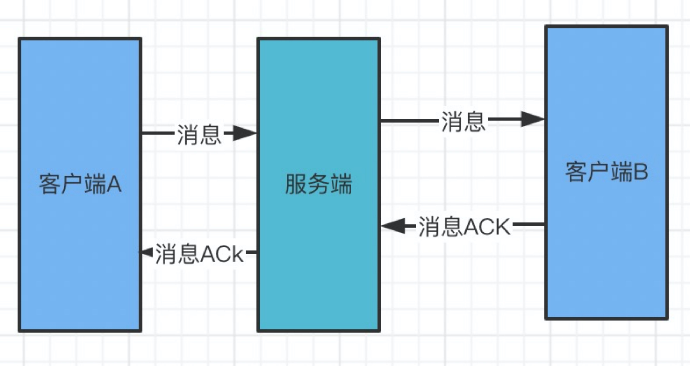
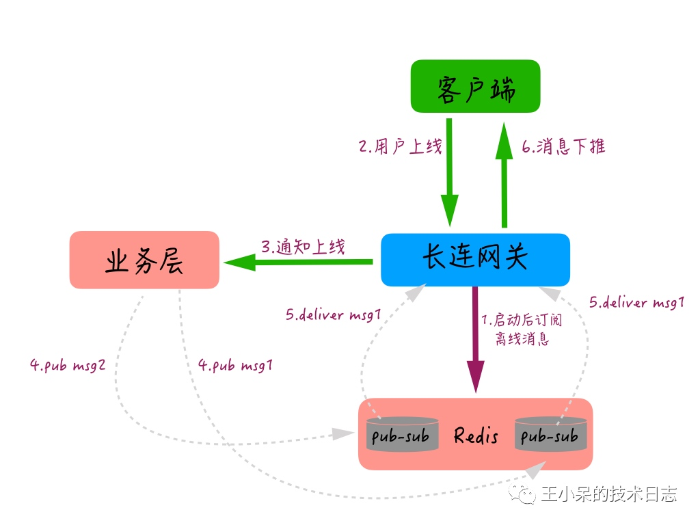
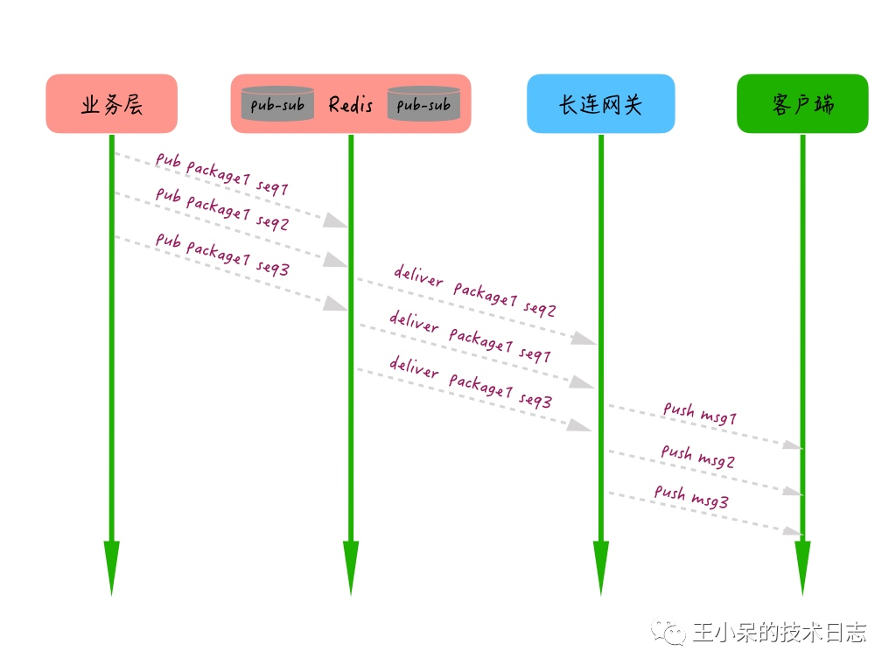
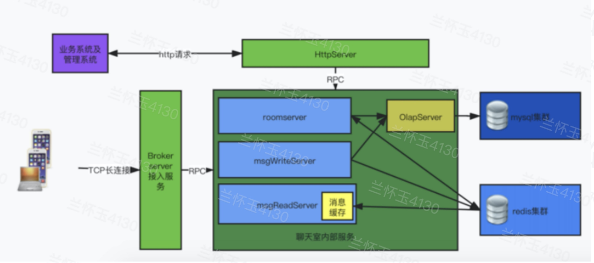
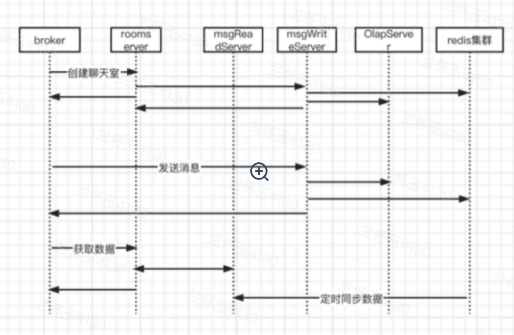

#2-进阶篇 基于Tars高并发IM系统的设计与实现
## 进阶篇
## 五个难题
通过前文可以搭建一个IM系统，实现IM的基本功能。
要想达到理想的商业使用状态还需要解决一些难题，本篇将着重讲解IM系统中常见难题及解决方法，如何设计可以让IM系统达到高可用，高性能，低延时，并发支撑千百万上亿的小目标。

IM系统中常见的5大难题分别是：
* 连接稳定
* 消息不丢不重
* 消息未读数准确
* 消息时序
* 超大群信息送达。

## 连接稳定
消息的收发及时对IM系统来说很重要，要做到消息及时收发依赖于稳定的TCP长连接；

要保持稳定的长连接需要解决几个棘手问题：
+ 连接缓慢
+ 身份认证耗时
+ 断网不能及时感知 
+ 中途断掉能快速重连

要保持连接稳定，需要解决以上问题，我们对以上问题逐一进行分析；

### 连接缓慢
主要原因有DNS解析反应慢，服务端接入服务过载，移动网络环境不稳定； 
DNS慢的情况可以做本地DNS缓存机制，没必要每次都需要做DNS解析； 
服务端接入过载，直接扩容接入服务器即可； 
移动网络环境不稳定，可以采用赛马策略进行网络连接，赛马策略是一种网络连接策略，连接时同时释放不止一个连接，选取最快连接，淘汰其他连接。 

#### 身份认证耗时 
正常身份认证需要在认证服务器（或者第三方认证服务）上走完所有流程，验证用户是否合法，依赖于认证服务器反应速度，身份认证的速度严重影响IM连接速度； 
为了减少对认证服务的依赖，IM对认证服务器认证结果进行缓存，缓存一定时间（可设置，一般24小时），采用IM内部认证来进行快速认证；这样大大减少对第三方认证服务的调用和依赖； 

#### 断网不能及时感知 
普通情况下TCP连接对断网或者切换网络不敏感，通常情况通过心跳和对网络状态的监控来解决问题； 

* 心跳： 
在客户端和服务端进行心跳报文交换； 
通常情况下，客户端/服务端大于2个心跳周期既收不到数据报文也收不到心跳报文，就认为TCP长连接断掉了，需要启动重新进行TCP连接； 
心跳时间最简单的就是固定时间，实现起来比较容易，简单粗暴 
要想达到好的效果，就需要根据网络环境，操作系统平台，终端等设计不同的心跳或者智能心跳，还是比较复杂，需要不断优化。 

* 网络状态监控 
客户端监控网络设备开启，关闭，切换等操作，只要有状态变化，就主动关闭当前TCP长连接；启动重新进行TCP连接； 

#### 中途断掉能快速重连
TCP长连接断掉很正常，如果断掉后，没有必要走完整的登录和初始化流程；
通常情况下连接成功后需要做认证，获取热会话，同步增量好友，同步群聊等；
走简化快速重连流程，减少连接过程太久对用户体验的不友好。

通过以上分析也许有人会说不是都有解决方法么，怎么还是难题呢，说是难题不是说不能解决，要做到最佳状态很难，满分100分，能做到70分就很有效，大多数人能做到50分就不错了； 
每个问题都需要好的策略设计，长时间的运行和调优才能达到比较好的状态； 

## 消息不丢不重，
这个命题有两个要点：不丢和不重

### 消息不丢
这里说的不丢主要指消息系统正常运转时消息的保证到达；
消息发送的流程如图: 

通过上图可以看到，要确保客户端A发的消息到达客户端B，并且消息不丢；必须做到如下： 
* 确保服务端能收到客户端A的消息并且落盘保存； 要做到这点，需要做到服务的收到客户端A的消息成功落盘后给客户端A一个确认ACK，客户端收到确认ACK后就可以认为次消息发送成功； 如果在一定时间内收不确认ACK就认为服务端没收到，需要重发消息直到收到确认ACK为止； 
* 确保客户端B能收到/获取到服务端的消息； 
* 客户端B分为在线和不在线两种情况； 
    - 在线时，服务端会直接讲消息推送给B，B收到消息后会回一个确认ACK给服务端； 
    - 不在线时，客户端B回先通过热会话获取最新消息和未读数，然后在跟据最新消息seqId获取离线时的历史消息； 

获取历史消息前文已经说明，要做到既少传数据，又保证数据完整也是一件很难的事情，一般情况都是用流量还稳定，可以允许有数据冗余，或者多拉数据来保证数据完整性； 

### 消息不重 
消息重复是由于消息重发导致，在一些情况下服务端收到消息后，客户端没及时收到确认ACK，触发客户端重新发送消息，这时候服务端会再次收到相同消息，服务端需要对于多余的消息进行排重处理； 

如何排重？ 
* 每个消息有一个唯一且不重复消息id，一般为UUID； 
* 服务端收到消息存储后，在返回确认ACK前，将消息Id保存在判重缓存器中； 
* 每个消息到服务端需要在判重缓存器中检测是当前消息id否已经存在，如果存在表示改消息已经接收到，为重复消息，直接给前端返回消息重复ACK，中止后续处理； 
* 以上3步也不能确保消息100%不重，为做到100%不重，客户端还需要将收到所有消息根据packId去重； 

通过以上4点可以做到消息不重，以上方案有2个缺点： 
* 判重缓存器中会持续增加，影响性能； 
* 每条消息都判重，也影响性能，毕竟大多数消息都是不需要重传的； 

针对以上两个缺点可以进行优化： 
* 判重缓存器设置淘汰策略，一般根据时间自动淘汰，packId在缓存器中保存时间设定一个时间，通常情况下半个小时足矣。 
* 重发的消息客户端都知道，带一个重发标记，服务端只根据重发标记进行消息判重即可，不需要每条消息都判重。 

## 消息未读数准确
未读数的显示对于IM系统来说也是一个基本功能，首先对未读数进行一个定义： 
* 用户未阅读的消息数量 
* 每个会话有个独立数量 
* 只要用户在某一个设备上阅读某个会话的消息，都算已读 

要实现以上未读数功能，有两种方式：
### 客户端计数
客户端计数实现针对多个设备上的数据同步比较复杂，需要 客户端-》服务端->客户端;不能保证数据最大的准确性； 

### 服务端计数 
服务端计数只需要维护服务端的数据正确性，每个客户端根据情况进行数据同步就行，少一步 客户端向服务器的同步操作，别小看这一步，针对一个多端多活的异步系统，能减少很多数据同步和完整性的维护操作，也减少很多逻辑。 

服务端未读数存储采用redis中zset结构，key为每个用户id+会话id，数据为未读消息id，seqid 
* 增加未读数：有新消息时向该key数据结构增加新消息的packId，seqid 
* 计算未读数：获取该key中的数量； 
* 减少未读数：通过已读消息的seqid，删除<=seqid所有数据 

假设用户id为22，会话id为s1，未读数变化如图： 

通过以上方式可以得到一个相对准确的未读数；要获取一个准确的未读数很难； 

主要有如下难题： 
* IM作为一个分布式系统，并发操作的情况下很难保持绝对的统一，客户端的已读消息指令不一定能非常准确发到服务端进行未读数变更，这样就出现客户端和服务端未读数不一致情况。 
* 终端设备很多，有iPhone/iPad，小米，华为，oppo，PC等每个设备的离线push推送中对未读数的定义和展现又不一致，要确保跟客户端软件中一致，也很难；细心的用户也许会发现著名IM软件微信和钉钉桌面图标上的未读数跟APP内部未读数经常也会不一致。 

## 消息时序
分为时间和序号

### 时间
分布式系统中，消息的时间一般都取服务端本地时间戳，一般IM系统服务主机不止一台，每台机器上时间可能会有差异，系统处理也会有延时，时间也许小范围（毫秒级）错乱；
比如两条消息序号seqId增长，时间戳大小可能正好相反；这种情况一般不影响用户体验，用户端显示消息时也不是每条消息都显示时间，一般显示到分钟；

### 序号 
消息序号有两种使用方法：会话独立序号和全局统一序号； 

* 会话独立序号 
每个会话独立计算序号，任意两个会话中的消息序号可能会重复或者顺序颠倒； 
    * 优点：
    不同会话可以选择不同序列号生成器，并发性好 
    * 缺点：
    高优先级消息来自不同会话，用消息序列号会产生问题，需要单独再产生一个冗余序号来重新排序；消息同步需要区分会话； 

* 全局统一序号 
全局一个序号生成器，不同会话，统一排序； 
    - 优点：
    任意会话中的消息序号不会重复或者顺序颠倒；高优先级，历史消息获取游标记录相对容易，只记录一个目前最新消息seqId即可，不需要记录每个会话的最新seqId； 
    
    - 缺点：
    对并发要求比较高 

### 如何产生全局唯一递增序号
对于IM系统来说，如何做到IM聊天消息离线差异拉取（差异拉取是为了节省流量）、消息多端同步、消息顺序保证等，是典型的IM技术难点；
主要满足以下几点：
* 序列号递增
* 保证唯一，不冲突 
* 服务重启不倒退
* 快速生成

关于序号seqId我同事写过一篇文章详细介绍，在此引用。

### SeqId的前世今生，如何保证消息顺序到达？
对于聊天、直播互动等业务来说，消息的时序代表的是发送方的意见表述和接收方的语义逻辑理解，如果时序一致性不能保证，可能就会造成聊天语义不连贯、容易出现曲解和误会。

实际上保证消息绝对有序在IM中是一个非常困难的问题，可以说每个大厂都为了解决这个问题较劲脑汁。 
**但是为什么保证消息时序一致性如此困难呢？**

从理论上来说，保持消息的时序一致性貌似并不难。
理论上，我们想象的消息收发场景中，只有单一的发送方、单一的接收方。
如果发送方和接收方的消息收发都是单线程操作，并且和 IM 服务端都只有唯一的一个 TCP 连接，来进行消息传输，IM 服务端也只有一个线程来处理消息接收和消息推送。这种场景下，消息的时序一致性是比较容易能得到保障的。但在实际的后端工程实现上，由于单发送方、单接收方、单处理线程的模型吞吐量和效率都太低，基本上不太可能存在。

更多的场景下，我们可能需要面对的是多发送方、多接收方、服务端多线程并发处理的情况。所以，知道了难点，我们再来看一看究竟在后端的工程实现上，保证消息的时序一致都存在哪些难点。

消息的时序一致性其实是要求我们的消息具备“时序可比较性”，也就是消息相对某一个共同的“时序基准”可以来进行比较，所以，要保证消息的时序一致性的一个关键问题是：
**我们是否能找到这么一个时序基准，使得我们的消息具备“时序可比较性”，也就是说所有的消息都依据一个统一的基准时序，即可满足时序的比较。本文我们统称这个基准时序为SeqId。**

#### 如何找到一个合理的SeqId？

**首先，我们来看看发送方的本地序号或者本地时钟是否可以作为SeqId？**

所谓发送方的本地序号或者本地时钟是指发送方在发送消息时携带一个本地的时间戳或者本地维护的一个序号给到 IM 服务端，IM 服务端再把这个时间戳或者序号和消息一起发送给消息接收方，消息接收方根据这个时间戳或者序号来进行消息的排序。显然这种方式是行不通的，原因有下面几点。

发送方时钟存在较大不确定因素，用户可以随时调整时钟导致序号错乱。

发送方本地序号可能会由于APP卸载或者其他因素导致清0，从而导致序号错乱。

类似“群聊消息”和“单用户的多端登录”这种多发送方场景，都存在：同一时钟的某一时间点，都可能有多条消息发给同一接收对象。比如同一个群里，多个人同时发言；或者同一个用户登录多台设备，两台设备同时给某一接收方发消息。多设备间由于存在时钟不同步的问题，并不能保证设备带上来的时间是准确的。

因此以发送方的本地时钟或者本地序号作为SeqId是不可靠的。

**其次， IM 服务器的本地时钟是否可以作为SeqId呢？**

IM 服务器的本地时钟作为SeqId是指：发送方把消息提交给 IM 服务器后，IM 服务器依据自身服务器的时钟生成一个时间戳，再把消息推送给接收方时携带这个时间戳，接收方依据这个时间戳来进行消息的排序。但是似乎IM 服务器的本地时钟作为接收方消息排序的SeqId 也不太合适。因为，在实际应用中，IM 服务都是集群化部署，集群化部署也就是许多服务器同时部署任务。每一台Server的本地时钟都有可能出现不一致。虽然多台Server通过 NTP 时间同步服务，能降低服务集群机器间的时钟差异到毫秒级别，但仍然还是存在一定的时钟误差，而且 IM 服务器规模相对比较大，时钟的统一性维护上也比较有挑战，整体时钟很难保持极低误差。

**最后， 是否可以有一个全局的序号生成器统一颁发SeqId 呢？**

经过以上分析，显然单机本地化的时钟或者序号都存在问题，那么如果有一个全局的时钟或者序号是不是就能解决这个问题了呢？比如说如果有一个全局递增的序号生成器，应该就能避免多服务器时钟不同步的问题，IM 服务端就能通过这个序号生成器发出的序号，来作为消息排序的SeqId。而且这种“全局序号生成器”可以通过多种方式来实现，常见的比如 Redis 的原子自增命令 incr，DB 自带的自增 id，或者类似 Twitter 的 snowflake 算法、“时间相关”的分布式序号生成服务等。

但是这里显然还是有一个很明显的挑战，如果由全局的序号生成器来颁发一个全局的SeqId, 这个全局的序号生成器会不会成为一个服务瓶颈？ 在一个及其复杂的高并发，高可用分布式环境中， 处理任何一条消息都需要请求一台全局的序号生成器，那么这个全局序号生成器的压力可想而知，就以微信的消息量为例，简直就是一个噩梦。

类似 Redis 的原子自增和 DB 的自增 id，都要求在主库上来执行“取号”操作，而主库基本都是单点部署，在可用性上的保障会相对较差，另外，针对高并发的取号操作这个单点的主库可能容易出现性能瓶颈。

而采用类似 snowflake 算法的时间相关的分布式“序号生成器”，虽然在发号性能上一般问题不大，但也存在一些问题。一个是发出的号携带的时间精度有限，一般能到秒级或者毫秒级，比如微博的 ID 生成器就是精确到秒级的，另外由于这种服务大多都是集群化部署，携带的时间采用的服务器时间，也存在时钟不一致的问题（虽然时钟同步上比控制大量的 IM 服务器也相对容易一些）。

**终极方案，全局序号生成器+局部唯一序号**

从业务层面考虑，对于群聊和多端登录这种场景，没有必要保证全局的跨多个群的绝对时序性，只需要保证某一个群的消息有序即可。这样的话，如果可以针对每一个群有独立一个“ID 生成器”，能通过哈希规则把压力分散到多个主库实例上，大量降低多群共用一个“ID 生成器”的并发压力。

对于大部分即时消息业务来说，可以采用分布式全局序号生成器策略。从产品的角度，可以接受消息时序上存在一定的细微误差，比如同一秒收到同一个群的多条消息，业务上是可以接受这一秒的多条消息。实际上，这种细微误差对于用户来说，基本也是无感知的。

#### 大厂如何管理SeqId？

* 微信
微信的聊天和朋友圈的消息时序也是通过一个“递增”的版本号服务来进行实现的。不过这个版本号是每个用户独立空间的，保证递增，不保证连续。

* 微博
微博的消息箱则是依赖“全局分布式的时间相关的 ID 生成器”来对私信、群聊等业务进行排序，目前的精度能保证秒间有序。

* Twitter 
Twitter 采用自己的snowflake算法来实现全局ID生成。核心思想是：使用41bit作为毫秒数，10bit作为机器的ID（5个bit是数据中心，5个bit的机器ID），12bit作为毫秒内的流水号（意味着每个节点在每毫秒可以产生 4096 个 ID），最后还有一个符号位，永远是0。

* Instagram 
先了解一下instagram 的存储策略，采用分片储存（ logic Shard ），一个Table可以为多个逻辑分片，而每一个分片都一个UID。
全局ID生成组成：
41 bits: Timestamp (毫秒)
13 bits: 每个 logic Shard 的代号 (最大支持 8 x 1024 个 logic Shards)
10 bits: sequence number; 每个 Shard 每毫秒最多可以生成 1024 个 ID
生成 unique ID 时, 41 bits 的 Timestamp 和 Snowflake 类似；此处不做详细介绍。

根据目前各个大厂分享的知识，关于seqid的生成策略基本采用类似的方法，比如：facebook,youtube等。

#### 消息服务端包内整流

虽然大部分情况下，聊天、直播互动等即时消息业务能接受“小误差的消息乱序”，但某些特定场景下，可能需要 IM 服务能保证绝对的时序。比如发送方的某一个行为同时触发了多条消息，而且这多条消息在业务层面需要严格按照触发的时序来投递。

一个例子：用户 A 给用户 B 发送最后一条分手消息同时勾上了“取关对方”的选项，这个时候可能会同时产生“发消息”和“取关”两条消息，如果服务端处理时，把“取关”这条信令消息先做了处理，就可能导致那条“发出的消息”由于“取关”了，发送失败的情况。对于这种情况，我们一般可以调整实现方式，在发送方对多个请求进行业务层合并，多条消息合并成一条；也可以让发送方通过单发送线程和单 TCP 连接能保证两条消息有序到达。

但即使 IM 服务端接收时有序，由于多线程处理的原因，真正处理或者下推时还是可能出现时序错乱的问题，解决这种“需要保证多条消息绝对有序性”可以通过 IM 服务端包内整流来实现。

比如：我们在实现离线推送时，在网关机启动后会自动订阅一个本 IP 的 Topic，当用户上线时，网关机会告知业务层用户有上线操作，这时业务层会把这个用户的多条离线消息 pub 给这个用户连接的那个网关机订阅的 Topic，当网关机收到这些消息后，再通过长连接推送给用户，整个过程大概是下图这样的。

图片
但是很多时候会出现 Redis 队列组件的 Sharding 和网关机多线程消费处理导致乱序的情况，这样，如果一些信令（比如删除所有会话）的操作被乱序推送给客户端，可能就会造成端上的逻辑错误。

然后再说一下离线推送服务端整流的过程：

图片
首先，生产者为每个消息包生成一个 packageID，为包内的每条消息加个有序自增的 seqId。

其次，消费者根据每条消息的 packageID 和 seqID 进行整流，最终执行模块只有在一定超时时间内完整有序地收到所有消息才执行最终操作，否则将根据业务需要触发重试或者直接放弃操作。通过服务端整流，服务端包内整流大概就是图中这个样子，我们要做的是在最终服务器取到 TCP 连接后下推的时候，根据包的 ID，对一定时间内的消息做一个整流和排序，这样即使服务端处理多条消息时出现乱序，仍然可以在最终推送给客户端时整流为有序的。

#### 消息接收端整流

携带不同序号的消息到达接收端后，可能会出现“先产生的消息后到”“后产生的消息先到”等问题，消息接收端的整流就是解决这样的一个问题的。

消息客户端本地整流的方式可以根据具体业务的特点来实现，目前业界比较常见的实现方式比较简单，步骤如下：

* 接收方收到消息后进行判定，如果当前消息序号大于前一条消息的序号就将当前消息追加在会话里；

* 否则继续往前查找倒数第二条、第三条等，一直查找到恰好小于当前推送消息的那条消息，然后插入在其后展示。

#### 全局唯一序号产生算法参考
* 《微信序列号生成算法》https://blog.csdn.net/weixin_34153893/article/details/89612114

* Leaf——美团点评分布式ID生成系统(推荐阅读，它给出了一些更加优秀的解决方案)
* 分布式系统唯一ID生成方案汇总(推荐阅读，借鉴出处)
* Snowflake--Twitter的分布式自增ID算法snowflake (Java版)(推荐阅读，Snowflake Code Provenance Information)
* Chronos--XiaoMi/chronos(Chronos，是实现高可用、高性能、提供全局唯一而且严格单调递增timestamp的服务。)
* 分布式唯一id：snowflake算法思考(对于snowflake时间回拨的解决方案)

## 超大群
### 定义
超过10000人的群都可以视为超大群；超大群消息量巨大，根据消息优先级进行处理，普通消息允许丢失； 
正常群聊也就几十人到几百人（微信限制最大500人） 
群聊中的消息要进行及时扩散，前文中描述的群聊消息转发模式在正常群聊情况下没什么问题； 
如果超大群也采用这种模式，系统的性能和消息的延时将会出现一些问题； 

### 例子对比 
100人的普通群，每秒1个人发消息；1分钟产生60条消息，每条消息产生100次消息转发；一分钟将产生6000次转发 
10000人的超大群，每秒有5人发消息；一分钟讲产生300条消息，每条消息产生10000次消息转发，一分钟将产生300万次转发； 

通过以上比对，超大群的消息转发量比普通群多几个数量级； 
所以如果通过普通群的模式来处理超大群一定会出现问题，拖垮整个IM服务； 

### 设计原则
超大群的处理方案与开放式聊天室一致，大致如下原则： 
* 放弃消息转发的推送模式，转而采用客户端主动拉消息模式； 
* 服务端根据客户的的拉请求，拉取增量消息；服务端减少大量消息的转发操作； 
* 客户端的消息拉取采用长轮训模式，既能达到及时，又能减少请求次数； 
* 超大群为一种新的形态，独立服务处理，不宜跟普通群放在一起处理； 

### 超大群技术设计
消息框架选型：
* 长连接+读扩散
* Tars微服务治理体系

实现准则
* 客户端与服务端保持一个长连接
* 客户端定时向服务器发出拉消息请求，获取最新消息；
* 连接断掉重连后拉取最新消息；
* 聊天室资料和人数由客户端定时调用接口刷新；
* 高优先级通道，高优先级消息由专用通道（优先发送，优先拉取），保证第一时间能够通知到聊天室房间；
* 未解散的聊天室数据保持在redis，同时保存在mysql中，解散后，redis数据清除，mysql中保存；
* 为了方便消息展示，消息中冗余发送者信息（名称，头像）
* 读消息服务缓存最新消息数据，定时从redis中同步最新一定消息条数；
* 所有服务均无状态，可以随时横向扩容；

架构

* 接入服务Brokerserver
所有用户的接入，长连接保持，负责客户端请求的处理和派发，该服务主要有如下功能：
1. 保持客户端长连接
2. 解析客户端请求并通过RPC派发到聊天室内部相应服务中
 
* 聊天室服务RoomServer
主要有如下功能：
1. 用户认证
2. 聊天室创建，资料修改
3. 人员进入，退出等聊天室操作处理
4. 产生系统消息“产生xxx进入聊天室消息
 
* 消息保存服务MsgWriteServer
主要有如下功能：
1. 解析消息
2. 消息存储到redis
3. 根据优先级处理消息
4. 将消息异步RPC给OLapserver
 
 
* 消息读取服务MsgReadServer
主要有如下功能：
 
1. 负责从内存中根据客户端请求查询并返回数据；
2. 定时从redis集群中同步最新消息到消息缓存中；
 
 
* 数据统计冷存储服务OlapServer
主要有如下功能：
1. 消息数据，聊天室数据mysql存储；
2. 统计数据的处理；
3. 针对http服务，统计数据的请求处理；

* 建聊天室，发送消息，获取聊天室数据时序图

