## 3-实战篇 基于Tars高并发IM系统的设计与实现
通过前文基础篇，进阶篇的介绍，相信大家已经对IM的基础能力实现，难点及其如何解决有了一个全面的了解与认识。
相信大家都迫不及待想看看一个高性能的IM系统到底怎么设计与实现，从本篇开始主要讲述如何实现一个完整的IM系统。

消息流转整体方案我们采用服务器中转方案：A通过服务器S将信息发给B 
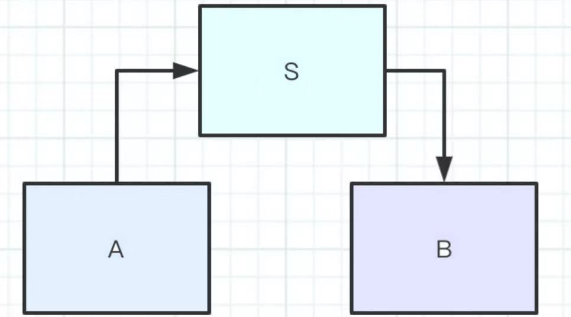

在目前互联网时代，已经有一些大公司提供了不错的开源基础平台供大家使用，站在巨人肩上可以省不少力。

Tars平台作为腾讯近几年推出的一款基础框架，在腾讯内部也适用广泛，以是C++方面开源少有且稳定的技术平台。 

笔者通过几年在IM领域对Tars的使用，对该框架也比较熟悉，是目前市场上C++语言IM领域比较适合的开发平台，其本身就是来源于QQ服务平台，对IM领域可以说是有天然的适应性，完全能够满足高可靠，高并发，低延时的基本性能需求。 

采用Tars平台总体设计方案，前文已经描述，具体见下图；
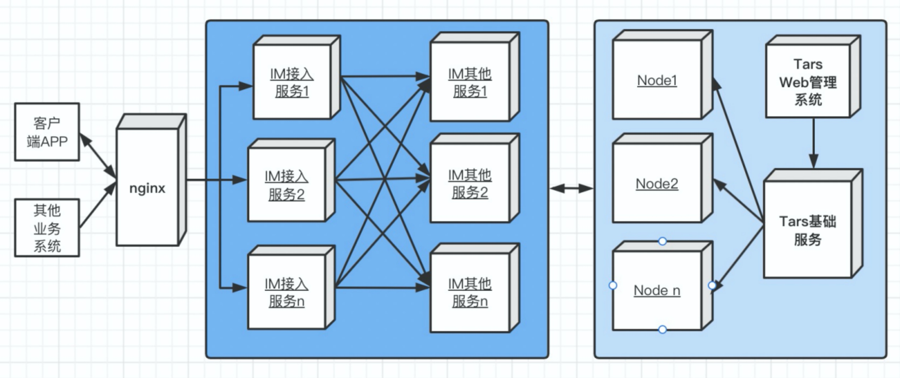

基于Tars框架实现的IM系统设计与实现，我们从下面三章内容着手介绍：
* Tars框架
* IM服务端实现
* IM客户端实现


## Tars框架
*本章节内容主要来自Tars在线文档：https://doc.tarsyun.com/*

### 基础介绍
Tars是基于名字服务使用Tars协议的高性能RPC开发框架，同时配套一体化的服务治理平台，帮助个人或者企业快速的以微服务的方式构建自己稳定可靠的分布式应用。
Tars是将腾讯内部使用的微服务架构TAF（Total Application Framework）多年的实践成果总结而成的开源项目。Tars这个名字来自《星际穿越》电影中机器人Tars， 电影中Tars有着非常友好的交互方式，任何初次接触它的人都可以轻松的和它进行交流，同时能在外太空、外星等复杂地形上，超预期的高效率的完成托付的所有任务。 拥有着类似设计理念的Tars也是一个兼顾易用性、高性能、服务治理的框架，目的是让开发更简单，聚焦业务逻辑，让运营更高效，一切尽在掌握。
目前该框架在腾讯内部，有100多个业务、10多万台服务器上运行使用。

### 设计思想
Tars的设计思路是采用微服务的思想对服务进行治理，同时对整个系统的各个模块进行抽象分层，将各个层次之间相互解耦或者松耦合，如下图：
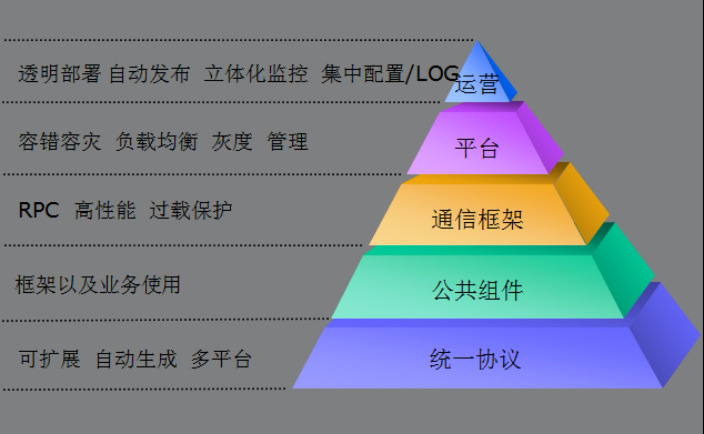

最底的协议层，设计思路是将业务网络通信的协议进行统一，以IDL(接口定义语言)的方式，开发支持多平台、可扩展、协议代码自动生成的统一协议。在开发过程中，开发人员只需要关注通讯的协议字段的内容，不需要关注其实现的细节，大大减轻了开发服务时需要考虑的协议是否能跨平台使用、是否可能需要兼容、扩展等问题。
中间的公共库、通讯框架、平台层，设计思路是让业务开发更加聚焦业务逻辑的本身。因此，从使用者的角度出发，封装了大量日常开发过程中经常使用的公共库代码和远程过程调用，让开发使用更简单方便；从框架本身的角度出发，做到高稳定性、高可用性、高性能，这样才能让业务服务运营更加放心；从分布式平台的角度出发，解决服务运营过程中，遇到的容错、负载均衡、容量管理、就近接入、灰度发布等问题，让平台更加强大。
最上面的运营层，设计思路是让运维只需要关注日常的服务部署、发布、配置、监控、调度管理等操作。
### 整体架构
* 架构拓扑
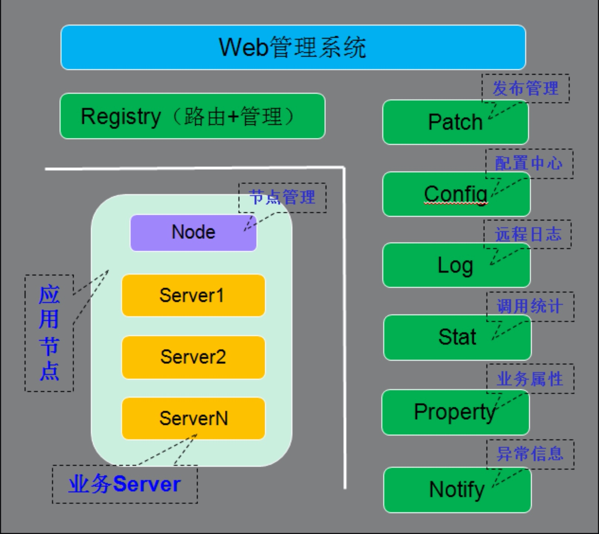
整体架构的拓扑图主要分为2个部分：
* 服务节点
* 公共框架节点。

#### 服务节点
服务节点可以认为是服务所实际运行的一个具体的操作系统实例，可以是物理主机或者虚拟主机、云主机。随着服务的种类扩展和规模扩大，服务节点可能成千上万甚至数以十万计。 每台服务节点上均有一个Node服务节点和N(N>=0)个业务服务节点，Node服务节点会对业务服务节点进行统一管理，提供启停、发布、监控等功能，同时接收业务服务节点上报过来的心跳。
#### 公共框架节点
除了服务节点以外的服务，其他服务节点均归为一类。
公共框架节点，数量不定，为了自身的容错容灾，一般也要求在在多个机房的多个服务器上进行部署，具体的节点数量，与服务节点的规模有关，比如，如果某些服务需要打较多的日志，就需要部署更多的日志服务节点。

又可细分为如下几个部分：
+ Web管理系统：在Web上可以看到服务运行的各种实时数据情况，以及对服务进行发布、启停、部署等操作；
+ Registry（路由+管理服务）：提供服务节点的地址查询、发布、启停、管理等操作，以及对服务上报心跳的管理，通过它实现服务的注册与发现；
+ Patch（发布管理）：提供服务的发布功能；
+ Config（配置中心）：提供服务配置文件的统一管理功能；
+ Log（远程日志）：提供服务打日志到远程的功能；
+ Stat（调用统计）：统计业务服务上报的各种调用信息，比如总流量、平均耗时、超时率等，以便对服务出现异常时进行告警；
+ Property（业务属性）：统计业务自定义上报的属性信息，比如内存使用大小、队列大小、cache命中率等，以便对服务出现异常时进行告警；
+ Notify（异常信息）：统计业务上报的各种异常信息，比如服务状态变更信息、访问db失败信息等，以便对服务出现异常时进行告警；

原则上要求全部的节点之间网络互通，至少每台机器的node能够与公共框架节点之间都是可以连通的。

* 服务交互流程
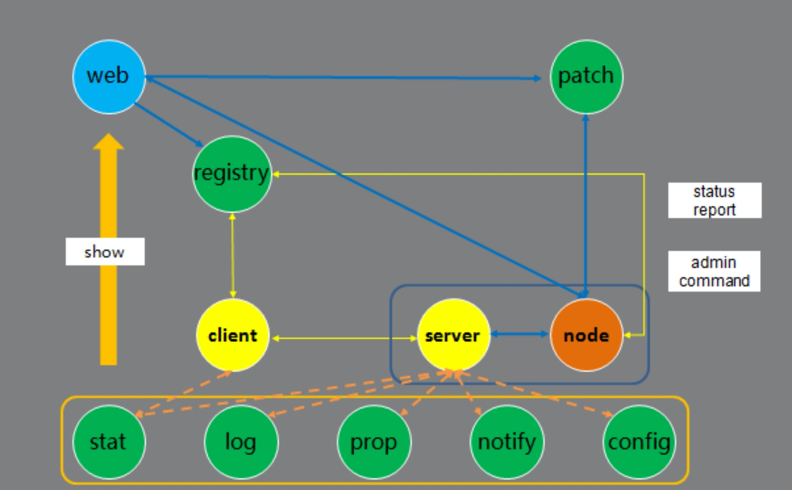

框架服务在整个系统中运行时，服务之间的交互分：业务服务之间的交互、业务服务与框架基础服务之间的交互。
- 服务发布流程：在Web系统上传server的发布包到patch，上传成功后，在web上提交发布server请求，由registry服务传达到node，然后node拉取server的发布包到本地，拉起server服务。
- 管理命令流程：Web系统上的可以提交管理server服务命令请求，由registry服务传达到node服务，然后由node向server发送管理命令。
- 心跳上报流程：server服务运行后，会定期上报心跳到node，node然后把服务心跳信息上报到registry服务，由registry进行统一管理。
- 信息上报流程：server服务运行后，会定期上报统计信息到stat，打印远程日志到log，定期上报属性信息到property、上报异常信息到notify、从config拉取服务配置信息。
- Client访问Server流程：client可以通过server的对象名Obj间接访问server，Client会从registry上拉取server的路由信息（如ip、port信息），然后根据具体的业务特性（同步或者异步，tcp或者udp方式）访问server(当然client也可以通过ip/port直接访问server)。

#### web管理系统
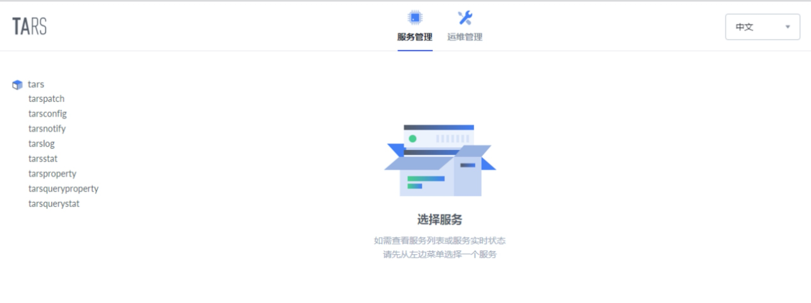

web管理系统主要包含以下功能：
* 业务管理：包括已部署的服务，以及服务管理、发布管理、服务配置、服务监控、特性监控等；
* 运维管理：包括服务部署、扩容、模版管理等；
#### 服务结构
框架核心的服务端与客户端实现结构图如下:
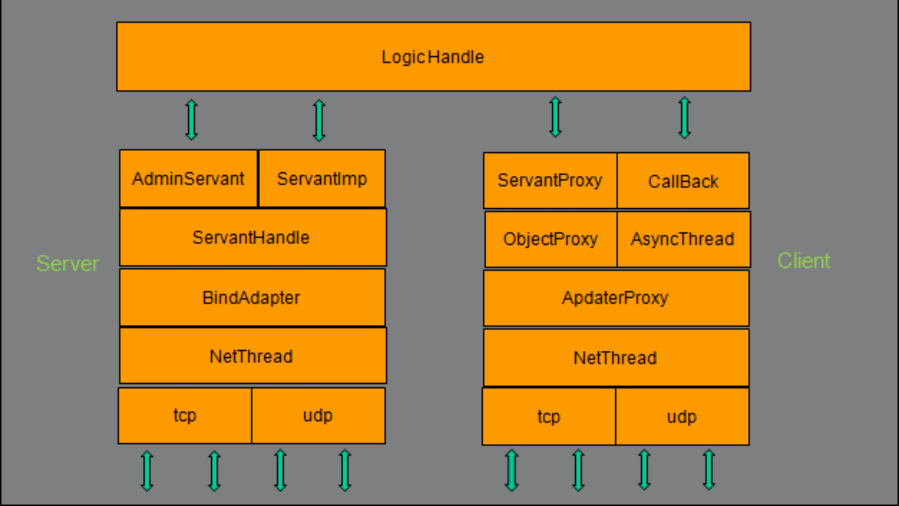

* 服务端：
    - NetThread： 收发包，连接管理，多线程(可配置），采用epoll ET触发实现，支持tcp/udp；
    - BindAdapter： 绑定端口类，用于管理Servant对应的绑定端口的信息操作；
    - ServantHandle：业务线程类，根据对象名分派Servant的对象和接口调用；
    - AdminServant： 管理端口的对象；
    - ServantImp： 继承Servant的业务处理基类（Servant：服务端接口对象的基类）；

* 客户端：
    - NetThread： 收发包，连接管理，多线程(可配置），采用epoll ET触发实现，支持tcp/udp；
    - AdapterProxy： 具体服务器某个节点的本地代理，管理到服务器的连接，以及请求超时处理；
    - ObjectProxy： 远程对象代理，负责路由分发、负载均衡、容错，支持轮询/hash/权重；
    - ServantProxy： 远程对象调用的本地代理，支持同步/异步/单向，Tars协议和非Tars协议；
    - AsyncThread： 异步请求的回应包处理线程；
    - Callback： 具体业务Callback的处理基类对象。


## 框架部署
### 部署简介
需要了解 Tars 部署基础知识:
Tars 由 mysql+框架服务+业务服务组成:
* mysql, 用于存储各种服务信息
* 框架服务是由多个 Tars 实现好的服务(c++实现), web 管理平台(nodejs)构成
* 业务服务是由开发团队根据产品需求自己实现的服务, 这些服务可以由 c++, java, go, nodejs, php 等语言实现

Tars 完成部署后, 从服务器角度, 它由以下几部分组成:
* mysql 集群(主从配置或者集群配置): 通常主从配置即可, 正常情况, 即使 mysql 挂了, 也不会影响业务服务的运行(但是会影响部署和发布)
* 框架服务: 是由多个 c++实现的 tars 服务 + web 管理平台组成, 通常部署在两台机器上, 其中一台会多部署 web 管理平台, tarspatch, tarsAdminRegistry, 运行过程中框架服务器都挂了, 也不会影响业务服务的运行(影响部署和发布)
* 多台节点服务器: 从 1 台至上万台, 每台节点服务器上都必须部署一个 tarsnode 进程, tarsnode 要连接到框架服务上(连接 tarsregistry)
* 业务自己实现的服务通过 web 管理平台发布到这些节点服务器上

Tars 的部署工作包括:
* mysql 的安装
* 框架服务部署(一般是两台服务器)
* 节点服务器部署(部署 tarsnode), 一般可以通过 web 管理平台远程部署节点服务器

注意:如果节点服务器上运行了不同语言实现的业务服务, 那么节点服务器的运行环境需要自己安装, 比如安装 jdk, node 等

Tars 部署方式有以下几种:
* 源码编译部署
* Docker 部署
* K8s Docker 部署
* K8s Tars 融合部署
* K8s Framework 融合部署

根据你的需要选择一种即可；
**推荐非K8S模式下使用Docker部署方式**

### 部署实例
本实例主要展示docker部署方式，此种方式对于新手来说比较友好。
#### 安装docker
Centos上安装Docker脚本如下:
```shell
sudo su
yum install -y yum-utils device-mapper-persistent-data lvm2
yum-config-manager --add-repo https://download.docker.com/linux/centos/docker-ce.repo
yum install -y docker-ce 
systemctl start docker
systemctl enable docker
```

安装完毕以后, 查看Docker版本:
    
    docker version

由于国内访问直接访问docker hub网速比较慢，拉取镜像的时间就会比较长。一般我们会使用镜像加速或者直接从国内的一些平台镜像仓库上拉取。

执行如下命令修改镜像源后，重启docker服务；
```shell
tee /etc/docker/daemon.json <<-'EOF'
{
  "registry-mirrors": ["https://docker.mirrors.ustc.edu.cn"]
}
EOF

systemctl restart docker
```
**linux下docker安装后，一般会有读写权限问题，执行如下命令进行设置：**
```
    setenforce 0
```
* 创建虚拟网络
为了方便虚拟机、Mac、Linux 主机等各种环境下的 docker 部署，在本示例中先创建虚拟网络，模拟现实中的局域网内网环境(注意 docker 都还是在同一台机器, 只是 docker 的虚拟 ip 不同, 模拟多机)
```
docker network create -d bridge --subnet=172.25.0.0/16 --gateway=172.25.0.1 tars
```
注:如果不需要虚拟网络，此步可以忽略

####  创建基础框架
为框架运行提供 MySQL 服务，若使用宿主机或现有的 MySQL 可以跳过此步骤，建议框架和应用使用不同的 MySQL 服务

准备好mysql服务相关用户名，口令；
比如：172.16.2.190 root/123456
```
虚网环境：
docker run -d \
    --name=tars-framework \
    --net=tars \
    -e MYSQL_HOST="x.x.x.x" \
    -e MYSQL_ROOT_PASSWORD="xxxx" \
    -e MYSQL_USER=root \
    -e MYSQL_PORT=3306 \
    -e REBUILD=true \
    -e INET=eth0 \
    -e SLAVE=false \
    --ip="172.25.0.3" \
    -v /data/framework:/data/tars \
    -v /etc/localtime:/etc/localtime \
    -p 3000:3000 \
    tarscloud/framework:v3.0.15
   
   主机环境：
   sudo docker run -d \
    --name=tars-framework \
    --net=host \
    -e INET=eth0 \
    -e MYSQL_HOST="x.x.x.x" \
    -e MYSQL_ROOT_PASSWORD="xxx" \
    -e MYSQL_USER=root \
    -e MYSQL_PORT=3306 \
    -e REBUILD=false \
    -e SLAVE=false \
    -v /opt/data/framework:/data/tars \
    -v /etc/localtime:/etc/localtime \
    tarscloud/framework:v3.0.15

```
说明:
- 使用指定版本，如：v3.0.10，便于开发和生产环境的部署，后期需要升级时可选择更新的版本 tag，升级之前请先查看 GitHub 的 changelog，避免升级到不兼容的版本造成损失。
- 注意这里的 Tag 不是源码 TarsFramework 的 tag 号, 而是 Tars 这个 GIT 仓库的 tag 号, 因为 tarscloud/framework 还包含了 TarsWeb
- 当部署好以后, TarsWeb 页面的右上角显示了内置的 TarsFramework&TarsWeb 的版本号, 以便你对应源码.
- mysql 版本8.0 缺省开启SSL,需要修改/etc/my.cnf.d/mysql-default-authentication-plugin.cnf参数skip_ssl关闭后重启方可生效。

安装完毕后, 访问 http://${your_machine_ip}:3000 打开 web 管理平台
第一次进入需要设置口令，登录后出现类似如下界面就OK了
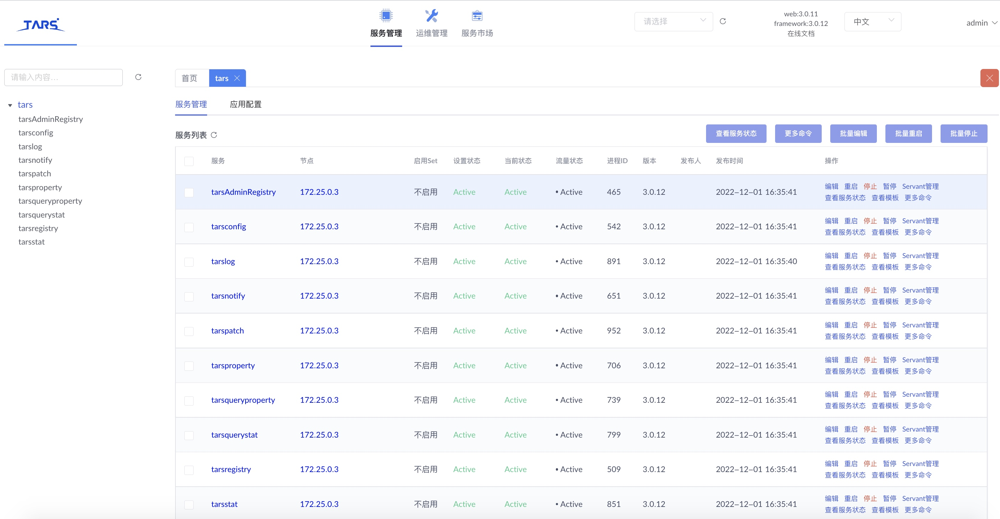


####  创建节点服务

```
虚网环境：
docker run -d \
    --name=tars-node \
    --net=tars \
    -e INET=eth0 \
    -e WEB_HOST="http://172.25.0.3:3000" \
    --ip="172.25.0.5" \
    -e TARS_HOSTPATH=/data/tars \
    -v /data/tars:/data/tars \
    -v /etc/localtime:/etc/localtime \
    -p 12000-12020:12000-12020 \
    -v /var/run/docker.sock:/var/run/docker.sock \
    tarscloud/tars-node:stable
  ```
  
  ```
  主机环境：
   docker run -d \
    --name=tars-node \
    --net=host \
    -e INET=eth0 \
    -e WEB_HOST="http://x.x.x.x:3000" \
    -v /opt/data/tars:/data/tars \
    -v /etc/localtime:/etc/localtime \
    tarscloud/tars-node:latest
```

- 虚网环境初始开放了 12000-12020 端口供应用使用
- Node 启动之后会自动向框架 172.25.0.3 进行注册，部署完成之后在框架的 **运维管理-节点管理** 中可以看到 IP 为 172.25.0.5 的节点启动

####  部署 redis
docker run --restart=always --log-opt max-size=100m --log-opt max-file=2 -p 6379:6379 --name myredis -v /home/redis/myredis/myredis.conf:/etc/redis/redis.conf -v /home/redis/myredis/data:/data -d redis redis-server /etc/redis/redis.conf  --appendonly yes  --requirepass 000415


部署成功后在web**管理平台-运维管理-节点管理**中能看见节点，如图：

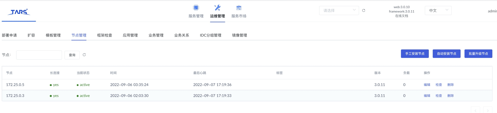

### 开发环境搭建

本节主要介绍Tars Cpp服务开发和编译时需要的开发环境, 以centos7来介绍.
*注意: 如果本机上之前源码编译部署过Tars CPP 开发环境, 无需再部署*

#### 依赖环境

软件|	软件要求
----|----
linux内核版本:|	2.6.18及以上版本
gcc版本:|	4.8 及以上版本、glibc-devel
bison工具版本:|	2.5及以上版本
flex工具版本:|	2.5及以上版本
cmake版本：|	3.2及以上版本
mysql版本：|	5.6及以上版本

#### 编译包依赖下载安装介绍

源码编译过程需要安装:gcc, glibc, bison, flex, cmake
例如，在Centos7下，执行：
```
yum install glibc-devel gcc gcc-c++ bison flex cmake

yum install zlib-devel

```
* 下载源码
```
git clone https://github.com/TarsCloud/TarsCpp.git --recursive 
```
* 编译安装
```shell
cd TarsCpp
mkdir build
cd build
cmake ..
make
make install
```
* 错误处理
如果cmake编译过程中遇到如下错误,
```
Make Error at servant/CMakeLists.txt:64 (add_subdirectory):
  add_subdirectory given source "protocol/servant" which is not an existing
  directory.


CMake Error at servant/CMakeLists.txt:65 (add_subdirectory):
  add_subdirectory given source "protocol/framework" which is not an existing
  directory.
```
原因是protocol子项目没pull下来，有两个方法可以解决：
- 到根目录执行如下命令：
```
git submodule update
```
- 到servant目录独立拉TarsProtocol后改名为protocol：
```
git clone https://github.com/TarsCloud/TarsProtocol.git
mv TarsProtocol protocol
```

至此, Tars Cpp的编译环境已经完成;
下一步可以实现Cpp的Tars服务了.

**注意：**

* GCC 4.9.2、 GCC 10.2.1编译没有问题
* GCC 12.2 编译mysqlclient有问题，报如下错误：
error Native atomics support not found!
* 在linux系统多人并行开发，为了防止多人并行开发导致公共文件冲突，需要修改/usr/local/tars/cpp/makefile/makefile.tars 如下内容：
    * 替换/home/tarsproto/" 为"${HOME}tarsproto/"
    
    

* 开启SSL, HTTP2:
```
cmake .. -DTARS_SSL=ON -DTARS_HTTP2=ON
make
make install
```
* 关闭SSL, HTTP2:
```
cmake .. -DTARS_SSL=OFF -DTARS_HTTP2=OFF
make
make install
```
注意默认情况下 examples的demo服务都没有编译, 如果希望编译这些demo服务, 请开启:
```
cmake .. -DONLY_LIB=OFF
```
### 快速开发入门
#### 创建服务
```
/usr/local/tars/cpp/script/create_tars_server.sh [App] [Server] [Servant]
```
本例中执行生成一个认证服务：
```
/usr/local/tars/cpp/script/create_tars_server.sh otim AuthServer AuthServant

```
命令执行后，会在当前目录的 otim/AuthServer目录下，生成下面文件：
```
AuthServer.h 
AuthServer.cpp 
AuthServant.tars 
AuthServantImp.h 
AuthServantImp.cpp 
makefile
```
#### 编译服务
```
make
```
这些文件，已经包含了最基本的服务框架和默认测试接口实现。

#### 服务实现
tars 接口文件
定义 tars 接口文件的语法和使用，参见 tars_tup
如下：
```c
AuthServant.tars：
module otim
{
struct AuthParam
{
    0 require  string   packId;
    1 require  LoginReq loginReq;
};

interface AuthServant
{
    int auth(otim::ClientContext clientContext, AuthParam authParam, out string extraData);
};

}; 

```
采用 tars2cpp 工具自动生成 c++文件：/usr/local/tars/cpp/tools/tars2cpp AuthServant.tars 会生成 AuthServant.h 文件，里面包含客户端和服务端的代码( 编译时会自动处理)。
AuthServantImp 是 Servant 的接口实现类
实现服务定义的 tars 件中的接口，如下：
```c++
#ifndef _AuthServantImp_H_
#define _AuthServantImp_H_

#include "servant/Application.h"
#include "AuthServant.h"

/**
 *
 *
 */
class AuthServantImp : public otim::AuthServant
{
public:
    /**
     *
     */
    virtual ~AuthServantImp() {}

    /**
     *
     */
    virtual void initialize();

    /**
     *
     */
    virtual void destroy();

    /**
     *
     */
	virtual tars::Int32 auth(const otim::ClientContext & clientContext,const otim::AuthParam & authParam,std::string &extraData,tars::TarsCurrentPtr _current_);
};
/////////////////////////////////////////////////////
#endif

```
```
#include "AuthServantImp.h"
#include "servant/Application.h"
#include "otim.h"
#include "log.h"

using namespace std;

//////////////////////////////////////////////////////
void AuthServantImp::initialize()
{
    //initialize servant here:
    //...
}

//////////////////////////////////////////////////////
void AuthServantImp::destroy()
{
    //destroy servant here:
    //...
}

tars::Int32 AuthServantImp::auth(const otim::ClientContext & clientContext,const otim::AuthParam & authParam,std::string &extraData,tars::TarsCurrentPtr _current_)
{
	MLOG_DEBUG("context:"<<clientContext.writeToJsonString()<<" authParam:"<<authParam.writeToJsonString());
    //实现认证代码添加到此处
    
	return 0;
}
```
```
/////////////////////////////////////////////////////////////////
#ifndef _AuthServer_H_
#define _AuthServer_H_

#include <iostream>
#include "servant/Application.h"

using namespace tars;

/**
 *
 **/
class AuthServer : public Application
{
public:
    /**
     *
     **/
    virtual ~AuthServer() {};

    /**
     *
     **/
    virtual void initialize();

    /**
     *
     **/
    virtual void destroyApp();
};

extern AuthServer g_app;

////////////////////////////////////////////
#endif

/////////////////////////////////////////////////////////////////

#include "AuthServer.h"
#include "AuthServantImp.h"
#include "RedisPool.h"
#include "otim_const.h"

using namespace std;

AuthServer g_app;

/////////////////////////////////////////////////////////////////
void
AuthServer::initialize()
{
    addServant<AuthServantImp>(ServerConfig::Application + "." + ServerConfig::ServerName + ".AuthServantObj");
}
/////////////////////////////////////////////////////////////////
void
AuthServer::destroyApp()
{
    //destroy application here:
    //...
}
/////////////////////////////////////////////////////////////////
int
main(int argc, char* argv[])
{
    try
    {
        g_app.main(argc, argv);
        g_app.waitForShutdown();
    }
    catch (std::exception& e)
    {
        cerr << "std::exception:" << e.what() << std::endl;
    }
    catch (...)
    {
        cerr << "unknown exception." << std::endl;
    }
    return -1;
}
/////////////////////////////////////////////////////////////////

```
每个 Servant(Obj)对象对应一个业务处理线程, 因此如果是成 AuthServantImp 的成员变量, 并且只被当前的 AuthServantImp 对象处理, 是不需要加锁的
#### 服务编译
进入代码目录,首先做
```
make
make tar
```
会生成 AuthServer.tgz 发布包。


* 客户端同步/异步调用服务
在开发环境上，创建/home/tarsproto/[APP]/[Server]目录。
例如：/home/tarsproto/otim/AuthServer 在刚才编写服务器的代码目录下，
执行 make release 这时会在/home/tarsproto/otim/AuthServer 目录下生成 h、tars 和 mk 文件。
这样在有某个服务需要访问 AuthServer 时，就直接引用 AuthServer 服务 make release 的内容，不需要把 AuthServer 的 tars 拷贝过来（即代码目录下不需要存放 AuthServer 的 tars 文件）。

要使用AuthServer的接口，有两种方式可以进行RPC。
* 同步方式：
```c++
	    otim::AuthParam authParam;
        authParam.packId = packId;
        authParam.loginReq = loginReq;
        
        otim::AuthServantPrx authServantPrx Application::getCommunicator()->stringToProxy("otim.AuthServer.AuthServantObj", authServantPrx);
        
        authServantPrx->auth(context, authParam);
```
* 异步方式
```c++
class UserAuthServantCallback : public otim::AuthServantPrxCallback
{
public:
	otim::ClientContext _context;

    otim::AuthParam _authParam;
    tars::TarsCurrentPtr _current;
public:
    UserAuthServantCallback(tars::TarsCurrentPtr current,const otim::ClientContext& clientContext, otim::AuthParam& param);
    
    virtual void callback_auth(tars::Int32 ret, const std::string &resp);
    
    virtual void callback_auth_exception(tars::Int32 ret);
    
    static void sendLoginAckToClient(tars::TarsCurrentPtr current,const std::string &packId, int code, const otim::LoginReq & loginReq, const std::string& extraData);
};
```
```
	    otim::AuthParam authParam;
        authParam.packId = packId;
        authParam.loginReq = loginReq;
        
        otim::AuthServantPrx authServantPrx ;
        Application::getCommunicator()->stringToProxy("otim.AuthServer.AuthServantObj", authServantPrx);

        tars::TC_AutoPtr<UserAuthServantCallback> authSrvCB = new UserAuthServantCallback(current, context, authParam);
        
        authServantPrx->async_auth(authSrvCB, context, authParam);
```

make 出目标文件，上传到能访问服务器的环境中进行运行测试即
也强烈建议你用 cmake 管理, 方式和服务端一样

其他你可能需要知道的重点:
* examples 下有几个非常重要的调用例子:同步, 异步, 协程, 代理模式, push 模式, HTTP 服务支持等, 建议仔细读一读
* 代码中的 Communicator 是管理客户端资源的, 建议做成全局, 如果不是独立的 Client 客户端, 而是在服务框架中, 直接获取框架提供好的 Communicator, 参见 ProxyServer
* 上述 Client 例子中Application::getCommunicator()->stringToProxy("otim.AuthServer.AuthServantObj", authServantPrx), 框架会自动寻址后端的 AuthServer 服务, 并自动完成容灾切换

### IM服务系统设计
&emsp;&emsp;一个完整高性能的IM服务设计在满足三大指标（高可用，高并发，低延时）、解决五大难题的同时，也要满足基本的业务功能。


&emsp;&emsp;要满足高可用，高并发，低延时三大指标，需要在架构设计上能满足要求，Tars高性能框架能够完全满足高可用、高并发两项指标；在使用Tars框架上，我们有多年使用经验。
&emsp;&emsp;低延时通过对内存，redis，mysql的合理分级使用可以到达目标。

&emsp;&emsp;下面分别给出IM服务体系的部署图，架构图，微服务交互等图。

#### IM服务分层部署图
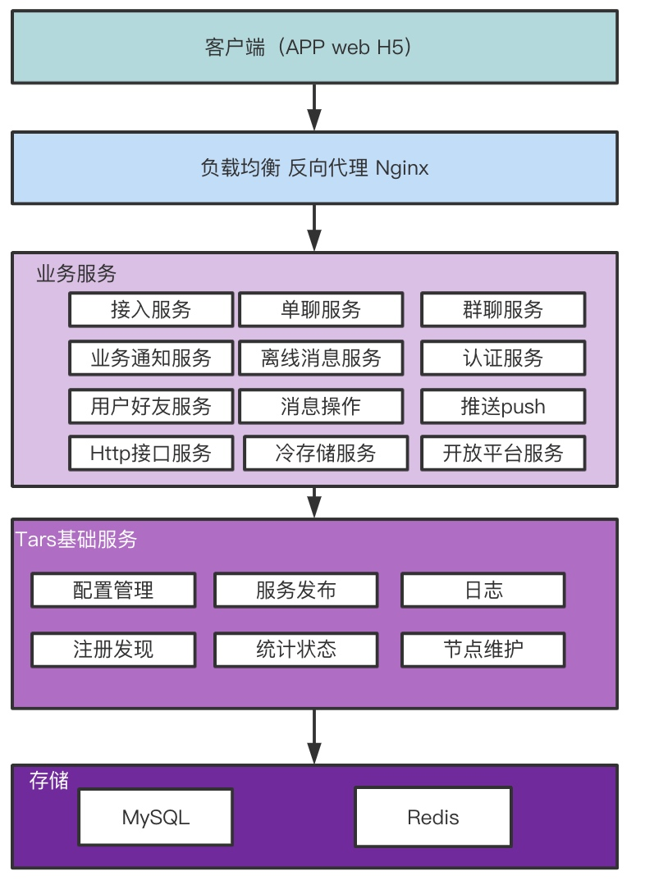
#### IM微服务体系架构图
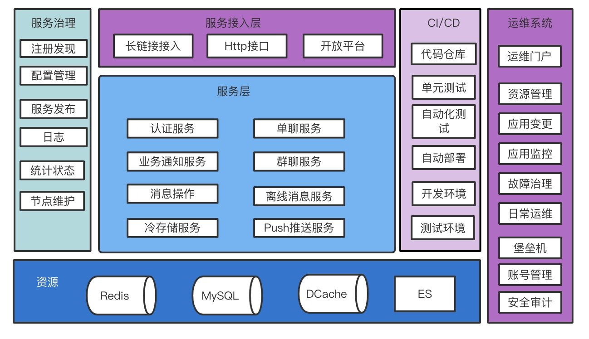


#### IM微服务模块架构图

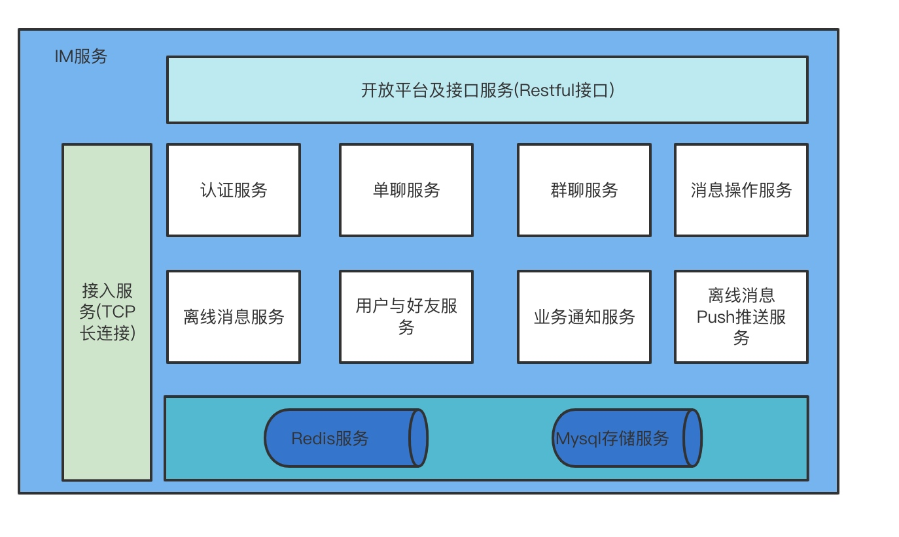

#### 微服务模块交互关系图： 
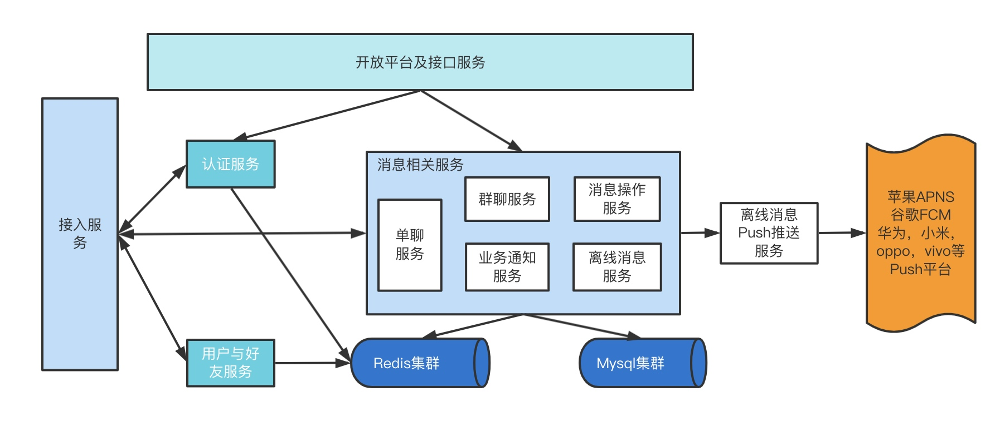
- 接入服务对外提供长链接服务
- 开放平台接口服务针对针外部服务提供rest接口。
- 除了接入服务，开放平台接口服务之外，其他服务都是对内提供RPC服务
- 内部服务根据情况可以有两套RPC接口：通用RPC接口，专用RPC接口。
- 通用RPC接口主要用于接入服务的请求消息派发。

#### 配置文件关系图

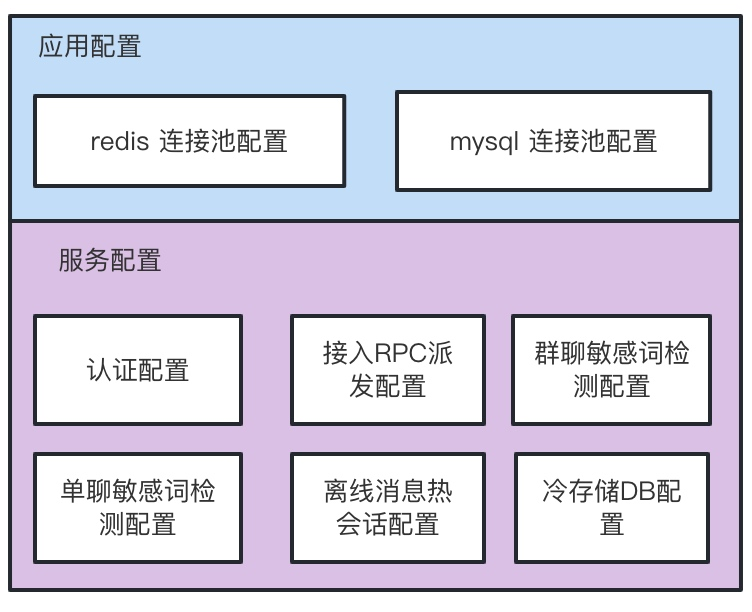


## 实现IM服务 
### IM服务包含的业务
* 自定义IM协议打包/解包实现
* 用户登录及身份认证 
* 退出登录 
* 用户被踢 
* 用户好友存取
* 长链接维持(心跳)
* 业务通知消息处理
* 单聊消息处理 
* 群聊消息处理 
* 最新消息会话，未读数处理 
* 消息撤回，删除等标记处理
* 历史消息存取
* 数据同步请求处理 
* 旁听会话处理 
* 群聊相关功能实现（创建，解散，加人，减人，资料修改等）
* 对外Http接口实现
* 离线消息push推送

要完成以上业务，需要通过不同的微服务模块来进行功能实现。

### IM服务系统包含的服务
 * 接入服务(BrokerServer)
 * 认证服务(AuthServer)
 * 用户好友服务(UserFriendServer)
 * 单聊服务(SingleChatServer)
 * 群聊服务(GroupChatServer)
 * 业务通知消息服务(BizMsgServer)
 * 历史消息服务(HistoryMsgServer)
 * 消息操作服务(MsgOperatorServer)
 * 数据分析及冷存储服务(OlapServer)
 * Http接口服务(HttpServer)
 * Push推送服务(PushServer)
 
 ### 创建服务
  **IM服务应用名称:otim(Open Tars IM)**
通过以下脚本，可以创建上文中设计的IM服务。
```shell
/usr/local/tars/cpp/script/create_tars_server.sh otim BrokerServer BrokerServant
/usr/local/tars/cpp/script/create_tars_server.sh otim AuthServer AuthServant
/usr/local/tars/cpp/script/create_tars_server.sh otim UserFriendServer UserFriendServant
/usr/local/tars/cpp/script/create_tars_server.sh otim SingleChatServer SingleChatServant
/usr/local/tars/cpp/script/create_tars_server.sh otim GroupChatServer GroupChatServant
/usr/local/tars/cpp/script/create_tars_server.sh otim BizMsgServer BizMsgServant
/usr/local/tars/cpp/script/create_tars_server.sh otim MsgOperatorServer MsgOperatorServant
/usr/local/tars/cpp/script/create_tars_server.sh otim HistoryMsgServer HistoryMsgServant
/usr/local/tars/cpp/script/create_tars_server.sh otim OlapServer OlapServant
/usr/local/tars/cpp/script/create_tars_server.sh otim PushServer PushServant

/usr/local/tars/cpp/script/create_http_server.sh otim HttpServer HttpServant
```
服务创建完成，下面就带大家对每个服务的设计开发进行分别进一步的剖析。

### 接入服务 BrokerServer
#### 主要功能
* 接受客户端长链接请求
* 记录客户端长链接信息
* 维护客户端长链接
* 打包/解包客户端请求
* 接收客户端请求，根据请求类型进行业务转发
* 向客户端推送消息/响应数据
下面章节主要针对每个服务的创建，接口定义实现，编译，部署进行详细介绍分析。

#### 根据协议打包/解包客户端请求
* 通过非Tars协议接受客户端数据；
```cpp
addServant<BrokerServantImp>(ServerConfig::Application + "." + ServerConfig::ServerName + ".BrokerServantObj");
```
* 通过Tars框架提供的方法设置监听端口的协议解析器，实现解包数据功能；
```cpp
  //设置监听端口的协议解析器
addServantProtocol(ServerConfig::Application + "." + ServerConfig::ServerName + ".BrokerServantObj", &OTIMProtocol::parse);
```
* 根据协议进行数据报文解析
```cpp
const uint32_t PKG_MIN_SIZE = 4;
const uint32_t PKG_MAX_SIZE = 640000;

struct OTIMProtocol
{
    static TC_NetWorkBuffer::PACKET_TYPE parse(TC_NetWorkBuffer &in, vector<char> &out)
    {
        if (in.getBufferLength() < PKG_MIN_SIZE)
        {
            return TC_NetWorkBuffer::PACKET_LESS;
        }
        
        string header;
        in.getHeader(PKG_MIN_SIZE, header);
        
        assert(header.size() == PKG_MIN_SIZE);
        
        uint32_t packLen = 0;
        
        ::memcpy(&packLen, header.c_str(), PKG_MIN_SIZE);
        
        packLen = ntohl(packLen);
        
        MLOG_DEBUG("packLen:"<<packLen);
        
        if (packLen > PKG_MAX_SIZE || packLen < PKG_MIN_SIZE)
        {
            throw TarsDecodeException("packet length too long or too short,len:" + TC_Common::tostr(packLen));
        }
        
        if (in.getBufferLength() < (uint32_t)packLen)
        {
            return TC_NetWorkBuffer::PACKET_LESS;
        }
        
        in.moveHeader(PKG_MIN_SIZE);
        
        in.getHeader(packLen-PKG_MIN_SIZE, out);
        in.moveHeader(packLen-PKG_MIN_SIZE);
        
        return TC_NetWorkBuffer::PACKET_FULL;
    }
};

``` 
#### 接受数据报文处理
根据不同的业务类型，不同处理；
```cpp

int BrokerServantImp::doRequest(tars::TarsCurrentPtr current, vector<char>& response)
{
    try {
        const vector<char>& request = current->getRequestBuffer();
        
        otim::OTIMPack pack;
        unpackTars<otim::OTIMPack>(request, pack);
        MLOG_DEBUG("pack type:"<<otim::etos((otim::PACK_TYPE)pack.header.type)<<" header:"<<pack.header.writeToJsonString());
        //get the context;
        LongLinkPtr pLongLink = LongLinkManager::getInstance()->update(current->getUId(), pack.header);
        
        MLOG_DEBUG("uid:"<<current->getUId()<<" context:"<<pLongLink->context.writeToJsonString()<<" pack header:"<<pack.header.writeToJsonString());
        //check process
        switch (pack.header.type) {
            case otim::PT_PING:
                this->processPingReq(current, pLongLink->context, pack);
                
                break;
            case otim::PT_LOGIN:
                this->processLoginReq(current, pLongLink->context, pack);
                break;
            case otim::PT_KICKOUT:
                this->processKickoutReq(current, pLongLink->context, pack);
                
                break;
            default:
                this->processReqRPC(current, pLongLink->context, pack);
                break;
        }
    } catch (std::exception& ex) {
        MLOG_ERROR("exception occur uid:"<<current->getUId()<<" ex:"<<ex.what());
        current->close();
    }
    
    return 0;
}

```

#### 配置文件拉取及Redis初始化
```cpp

    bool ret = addAppConfig(otim::CONF_REDIS);
    MLOG_DEBUG("addAppConfig:"<<otim::CONF_REDIS<<" ret:"<<ret);

    std::string redisConf = ServerConfig::BasePath+otim::CONF_REDIS;
    MLOG_DEBUG("redisConf File:"<<redisConf);
  
    ret = addAppConfig(otim::CONF_MYSQL);
 
 
    ret = addConfig(ServerConfig::ServerName + ".conf");
    std::string serverConfFile = ServerConfig::BasePath+ServerConfig::ServerName+".conf";

    MLOG_DEBUG("addConfig:"<<serverConfFile);
    TC_Config myConf;
    myConf.parseFile(serverConfFile);
    
    int redisConnCount = TC_Common::strto<int>(myConf.get("/otim/pool<redis>", "5"));

    otim::initRedisPool(redisConnCount, redisConf);


```


#### 长链接实现
* 接受，记录客户端客户端长链接
认证成功之后，就可以接受长链接，定期接受客户端发送心跳数据报文维持长链接；
- 长链接记录分为两部分：内存存储，redis存储
- 内存中保存当前服务的长链接信息；redis中保存所有服务的长链接信息；
- 长链接信息包含客户端相关信息（比如clientId，版本号，长链接id，登录时间，是否压缩，是否加密等等），实现类：LongLink
```cpp
struct LongLink{
    otim::ClientContext context;
    tars::TarsCurrentPtr current;
    int ptclVersion;
    int crypto;          //加密算法
    int compress;        //压缩算法
    int64_t loginTime;
    
    LongLink(){
        ptclVersion = 1;
        crypto = 0;
        compress = 0;
        loginTime = TC_Common::now2ms();
    }
    
    bool isValid(){
        if (context.clientId.empty() || context.deviceId.empty()){
            return false;
        }
        
        return true;
    }
    
    std::map<std::string, std::string> getMap(){
        std::map<std::string, std::string> mapValue;
        mapValue["clientId"] = context.clientId;
        mapValue["deviceType"] = std::to_string(context.deviceType);
        mapValue["deviceId"] = context.deviceId;
        mapValue["uid"] = std::to_string(context.uid);
        mapValue["ptclVersion"] = std::to_string(ptclVersion);
        mapValue["loginTime"] = std::to_string(loginTime);
        mapValue["brokerId"] = context.brokerId;

        return mapValue;
   }
    
    std::string toJson();
    void fromJson(const std::string &json);
};

```
- redis长链接用单例类LongLinkRedis处理；
```cpp
class LongLinkRedis : public tars::TC_Singleton<LongLinkRedis>
{
public:
    void remove(const std::string &clientId, int deviceType);
    void add(LongLinkPtr p);
    std::vector<LongLinkPtr> getLongLinkByClientId(const std::string &clientId);
 };

```
- 内存长链接用单例类LongLinkManager处理；
    - 根据uid获取到长链接信息
    - 根据clientId获取到长链接信息
    - 更新长链接信息
    - 移除长链接信息
```cpp
class LongLinkManager : public tars::TC_Singleton<LongLinkManager>
{
public:
    void remove(uint64_t uid);
    LongLinkPtr update(uint64_t uid, const otim::OTIMHeader & header);
    LongLinkPtr update(uint64_t uid, const otim::ClientContext &context);
    
    std::vector<LongLinkPtr> getLongLinkByClientId(const std::string &clientId);
    LongLinkPtr getLonglinkByUId(uint64_t uid);
private:
    LongLinkPtr get(uint64_t uid);
    void updateRedis(LongLinkPtr link);
    
    std::mutex _mutex;
    std::map<uint64_t, LongLinkPtr> _mapLonglink;
    std::map<std::string, std::set<uint64_t>> _mapClientIdUid;

};
```
* 长链接维护--心跳
```cpp
......
 case otim::PT_PING:
        this->processPingReq(current, pLongLink->context, pack);
        break;            
......
void BrokerServantImp::processPingReq(tars::TarsCurrentPtr current, const otim::ClientContext &context, const otim::OTIMPack &req)
{
    MLOG_DEBUG("ping Req:"<<req.writeToJsonString());
    otim::OTIMPack respPack = req;
    respPack.header.flags |= otim::PF_ISACK;
 
    g_app.sendDataToClient(current, respPack);
}
```

 ### 业务请求转发
 接收客户端业务请求，根据请求类型（Header中的type字段）进行业务转发；接入服务只根据类型转发，对业务数据（payload)不进行解析，这样做的好处可以提高接入服务的吞吐量和处理能力。
 转发流程如图：
 
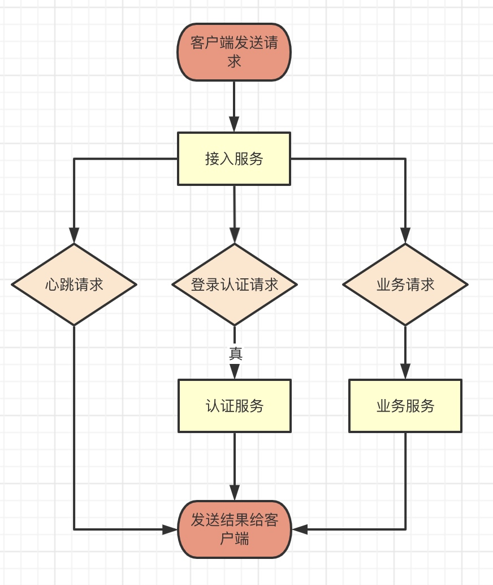

 
 业务请求转发规则通过配置文件来进行配置；
 * 转发配置如下：
 ```xml
 <otim>
<servermap>
<server1>
type=19,20,21
name=otim.HistoryMsgServer.HistoryMsgServantObj
</server1>
<server2>
type=14
name=otim.SingleChatServer.SingleChatServantObj
</server2>

<server3>
type=15,40,41,42,43,44,45,46,47
name=otim.GroupChatServer.GroupChatServantObj
</server3>

<server4>
type=51,52,53,54,55,56,57,58
name=otim.UserFriendServer.UserFriendServantObj
</server4>

<server5>
type=17,18
name=otim.MsgOperatorServer.MsgOperatorServantObj
</server5>
</servermap>
</otim>
 ```
 
 * 配置解析
 ```cpp
 
    std::vector<std::string> vList = myConf.getDomainVector("/otim/servermap");
    for (auto strItem : vList)
    {
        std::string keypath = "/otim/servermap/" + strItem;
        std::string strType = myConf.get(keypath+"<type>");
        MLOG_DEBUG("keypath:" << keypath<<"  value:"<<strType);
        
        vector<std::string> vctType = TC_Common::sepstr<std::string>(strType, ",", false);
        std::string serverName = myConf.get(keypath+"<name>");
        if (serverName.empty()){
            MLOG_ERROR("servername empty:"<<keypath);
            continue;
        }
        
        for (auto strType : vctType){
            if (strType.empty()){
                continue;
            }
            
            int type = TC_Common::strto<int>(strType);
            _mapServerName[type] = serverName;
            MLOG_DEBUG("type:" << type<<"  serverName:"<<serverName);
        }
    }
    
 ```
 
 * 转发逻辑
 ```cpp
 
        auto iter = _mapServerName.find(req.header.type);
        if (iter == _mapServerName.end()){
            MLOG_ERROR("serverName empty, type can't support:" << req.header.type <<" clientId:"<<context.clientId);
            return;
        }
        
        std::string serverName = iter->second;
        
        MLOG_DEBUG("uid:"<<current->getUId()<<" type:"<<otim::etos((otim::PACK_TYPE)req.header.type) << "("  << req.header.type << ")" <<" server:"<<serverName<<" clientId:"<<context.clientId);
        
        otim::BaseServantPrx proxy;
        Application::getCommunicator()->stringToProxy(serverName, proxy);
        tars::TC_AutoPtr<CommonServantPrxBrokerCallback> cb = new CommonServantPrxBrokerCallback(current, context, req);
        
        proxy->async_request(cb, context, req);

 ```
 
#### Tars接口（对内部其他服务提供接口，比如单聊，群聊等）
```cpp

interface BrokerPushServant
{
    int push(long uid, OTIMPack pack);
    int syncMsg(otim::ClientContext clientContext, OTIMPack pack);
    int kickout(otim::ClientContext clientContext, long uid);
};
```
* 向客户端推送消息
    
    int push(long uid, OTIMPack pack);
```
       LongLinkPtr longlink = LongLinkManager::getInstance()->getLonglinkByUId(uid);
        if (longlink.get() == nullptr){
            MLOG_DEBUG("longlink is null:"<<uid);
            return 0;
        }
        MLOG_DEBUG("longlink uid:" << longlink->context.uid<<" ptcl version:"<<longlink->ptclVersion);
        g_app.sendDataToClient(longlink->current, pack);

```

* 同一用户同步消息到其他端
    
    int syncMsg(otim::ClientContext clientContext, OTIMPack pack);

```cpp

tars::Int32 BrokerPushServantImp::syncMsg(const otim::ClientContext & clientContext, const otim::OTIMPack & pack,tars::TarsCurrentPtr current)
{
    try
    {
        std::vector<LongLinkPtr> listLink = LongLinkManager::getInstance()->getLongLinkByClientId(clientContext.clientId);
        
        MLOG_DEBUG("clientId:"<<clientContext.clientId<<" type:"<<pack.header.type<<" payload size:" <<  pack.payload.size()<<" version:"<<pack.header.version);
        for (auto longlink : listLink)
        {
            if (longlink.get() == nullptr){
                MLOG_DEBUG("longlink is null:"<<clientContext.clientId);
                continue;
            }
            if (longlink->context.uid == clientContext.uid){
                MLOG_DEBUG("the current is myself will ignore uid:" << longlink->context.uid<<" clientId:"<<clientContext.clientId);
                continue;
            }
            
            MLOG_DEBUG("longlink uid:" << longlink->context.uid<<" ptcl version:"<<longlink->ptclVersion);
            g_app.sendDataToClient(longlink->current, pack);
        }
    }
    catch (std::exception &e)
    {
        MLOG_ERROR("BrokerPushServantImp::push error:" << e.what());
    }
    catch (...)
    {
        MLOG_ERROR("BrokerPushServantImp::push error: unknown exception.");
    }
   
    return 0;
}
```

* 踢出用户某个链接
   
    int kickout(otim::ClientContext clientContext, long uid);
```cpp

 LongLinkPtr link = LongLinkManager::getInstance()->getLonglinkByUId(uid);
    if (link.get() == nullptr){
        MLOG_DEBUG("link is null:"<<uid);
    }

    MLOG_DEBUG("kickout uid:" << uid<<" clientId:"<<link->context.clientId<<" new Uid:"<<clientContext.uid);
    
    otim::OTIMPack pack;
    pack.header.type = otim::PT_KICKOUT;
    pack.header.version = link->ptclVersion;
    g_app.sendDataToClient(link->current, pack);

    MLOG_DEBUG("[KICKOUT]  uid:"<< link->context.uid << " clientId:"<< link->context.clientId << ", " << link->context.deviceType << " deviceId:" << link->context.deviceId);
    
    link->current->close();
```

####  认证服务 AuthServer
根据用户登录认证请求，进行处理，可以调用第三方认证服务，也可以是本机认证服务，根据需求处理；

```cpp
struct AuthParam
{
    0 require  string   packId;
    1 require  LoginReq loginReq;
};

interface AuthServant
{
    int auth(otim::ClientContext clientContext, AuthParam authParam, out string extraData);
};

tars::Int32 AuthServantImp::auth(const otim::ClientContext & clientContext,const otim::AuthParam & authParam,std::string &extraData,tars::TarsCurrentPtr _current_)
{
	MLOG_DEBUG("context:"<<clientContext.writeToJsonString()<<" authParam:"<<authParam.writeToJsonString());
	return 0;
}
```
##### 如何对接自己的认证系统
实现AuthServantImp::auth方法即可
```cpp
tars::Int32 AuthServantImp::auth(const otim::ClientContext & clientContext,const otim::AuthParam & authParam,std::string &extraData,tars::TarsCurrentPtr _current_)
{
	MLOG_DEBUG("context:"<<clientContext.writeToJsonString()<<" authParam:"<<authParam.writeToJsonString());
	//实现认证代码添加到此处
	return 0;
}
```

####  用户好友服务 UserFriendServer
该服务主要处理以下请求逻辑：
- 添加好友
- 删除好友
- 同步好友
- 设置/更新用户资料
- 获取用户资料
- 设置用户属性（备注，别名等）
- 获取用户属性（备注，别名等）

服务收到请求后，根据请求类型进行不同处理：
```cpp
    switch(req.header.type){
        case otim::PT_FRIEND_ADD:
            this->addFriend(clientContext, req, resp);
            break;
        case otim::PT_FRIEND_DEL:
            this->removeFriend(clientContext, req, resp);
            break;
        case otim::PT_FRIEND_SYNC:
            this->syncFriends(clientContext, req, resp);
            break;
        case otim::PT_USERINFO_GET:
            this->getUserInfo(clientContext, req, resp);
            break;
        case otim::PT_USERINFO_UPDATE:
            this->updateUserInfo(clientContext, req, resp);
            break;
        case otim::PT_USERATTRIBUTE_SET:
            this->setUserAttribute(clientContext, req, resp);
            break;
        case otim::PT_USERATTRIBUTE_GET:
            this->getUserAttribute(clientContext, req, resp);
            break;
        case otim::PT_SESSIONATTRIBUTE_SET:
            this->setSessionAttribute(clientContext, req, resp);
            break;
        default:
            MLOG_DEBUG("the type is  invalid:"<<otim::etos((otim::PACK_TYPE)req.header.type));
            return otim::EC_PROTOCOL;
    }
    

```

以上功能主要通过如下方法实现：
```cpp

    int syncFriends(const otim::ClientContext & clientContext, const otim::OTIMPack & req,  otim::OTIMPack & resp);
    int addFriend(const otim::ClientContext & clientContext, const otim::OTIMPack & req,  otim::OTIMPack & resp);
    int removeFriend(const otim::ClientContext & clientContext, const otim::OTIMPack & req,  otim::OTIMPack & resp);
    
    int updateUserInfo(const otim::ClientContext & clientContext, const otim::OTIMPack & req,  otim::OTIMPack & resp);
    int getUserInfo(const otim::ClientContext & clientContext, const otim::OTIMPack & req,  otim::OTIMPack & resp);
    
    int setUserAttribute(const otim::ClientContext & clientContext, const otim::OTIMPack & req,  otim::OTIMPack & resp);
    int getUserAttribute(const otim::ClientContext & clientContext, const otim::OTIMPack & req,  otim::OTIMPack & resp);
    int setSessionAttribute(const otim::ClientContext & clientContext, const otim::OTIMPack & req,  otim::OTIMPack & resp);


```

####  单聊服务 SingleChatServer
处理用户单聊请求，包含：
* 分配seqId,更新时间戳
```cpp
    msgReq.timestamp = msgAck.timestamp;
    msgReq.seqId = genSeqId();
```
* 保存单聊消息
```cpp
    otim::RedisConnPtr redis(otim::RedisPool::instance());
    assert(redis.get() != nullptr);
    
    std::string msg;
    pack.SerializeToString(&msg);
    MLOG_DEBUG("packId:"<<pack.header.writeToJsonString()<<" msgsize:"<<msg.size());
    EMRStatus ret = redis->ZSetAdd(otim::RKEY_MSG + sessionId, seqId, msg);
    if ( EMRStatus::EM_KVDB_SUCCESS != ret )
    {
        MLOG_ERROR("save msg fail:"<<ret);
        return otim::EC_REDIS_ERROR;
    }
   
     
    //save to db
    saveToMysql(clientContext, pack, sessionId, seqId);

```
* 更新会话信息,更新未读数
```cpp
int SingleChatServantImp::updateSession(const otim::ClientContext & clientContext, const otim::OTIMPack & req, otim::MsgReq &msgReq)
{
    MLOG_DEBUG("packId:" << req.header.packId <<" to:" << msgReq.to << " sessionId:" << msgReq.sessionId<<" seqId:"<<msgReq.seqId);
    if (msgReq.sessionId.empty()){
        MLOG_ERROR("_updateSessionListofUser sessionId is empty!!!!!!");
        return otim::EC_SUCCESS;
    }
    
    otim::RedisConnPtr redis(otim::RedisPool::instance());
    assert(redis.get() != nullptr);

    EMRStatus ret = redis->ZSetAdd(otim::RKEY_HOTSESSION + msgReq.to, msgReq.seqId, msgReq.sessionId);
    if (ret != EMRStatus::EM_KVDB_SUCCESS){
        MLOG_ERROR("update HOTSESSION fail, to" << msgReq.to << ", " << msgReq.sessionId);
    }
    
	ret = redis->ZSetAdd(otim::RKEY_HOTSESSION + msgReq.from, msgReq.seqId, msgReq.sessionId);
    if (ret != EMRStatus::EM_KVDB_SUCCESS){
        MLOG_ERROR("update HOTSESSION fail, from" << msgReq.from << ", " << msgReq.sessionId);
    }

    //save unread count
    std::string key = otim::RKEY_UNREADCOUNT + msgReq.to + "." + msgReq.sessionId;
    ret = redis->ZSetAdd(key, msgReq.seqId, req.header.packId);
    if(ret != EMRStatus::EM_KVDB_SUCCESS)
    {
        MLOG_ERROR("update RKEY_UNREADCOUNT fail, key" << key << " packId:"<< msgReq.packId);
    }

    return otim::EC_SUCCESS;
}
```
* 将消息推送给目标用户
```cpp
int SingleChatServantImp::dispatchMsg(const otim::ClientContext & clientContext, const otim::OTIMPack & req, const std::string &to)
{
    std::vector<LongLinkPtr> vctLink = LongLinkRedis::getInstance()->getLongLinkByClientId(to);
    if (vctLink.size() == 0){
        //need push
        MLOG_DEBUG("the user offline ,will push msg:"<<to<<" packId:"<<req.header.packId);
        return otim::EC_SUCCESS;
    }
    
    for (auto item : vctLink){
        try
        {
            if (item->context.brokerId.empty()){
                MLOG_ERROR("brokerId is empty uid: " << item->context.uid);
                continue;
            }
  
            otim::BrokerPushServantPrx brokerPrx = getServantPrx<otim::BrokerPushServantPrx>(item->context.brokerId);
            brokerPrx->async_push(NULL, item->context.uid, req);
            MLOG_DEBUG("USERONLINE push uid:" << item->context.uid << " userId:" << to << " packId:" << req.header.packId << " size: " << req.payload.size());
        }
        catch (std::exception& e)
        {
            MLOG_ERROR("USERONLINE push error: " << e.what());
            continue;
        }
        catch (...)
        {
            MLOG_ERROR("USERONLINE push unknown exception");
        }
    }
    
    return otim::EC_SUCCESS;
}

```
* 发ACK给发送者
```cpp
resp.header = req.header;
resp.header.flags |= otim::PF_ISACK;
  
otim::MsgAck msgAck;
msgAck.timestamp = TC_Common::now2ms();
msgAck.code = otim::EC_SUCCESS;
msgAck.seqId = msgReq.seqId;
msgAck.sessionId = msgReq.sessionId;


packTars<otim::MsgAck>(msgAck, resp.payload);

void CommonServantPrxBrokerCallback::callback_request(tars::Int32 ret, const otim::OTIMPack &resp)
{
    MLOG_DEBUG("rpc success context:"<<_context.writeToJsonString()<<" req:"<<_req.writeToJsonString()<<" resp:"<<resp.writeToJsonString());
   
    //send to client
    g_app.sendDataToClient(_current, resp);
}

```

####  群聊服务 GroupChatServer

群聊服务既可以接受来自BrokerServer的用户请求，也需要接收来自其他服务的RPC请求;所以本服务提供两套RPC接口：通用RPC接口和专用RPC接口。

##### 通用RPC接口
通用RPC接口主要处理如下请求：
- 创建群聊
- 群聊加成员
- 群聊减成员
- 修改群资料
- 发群消息
- 换群主
- 解散群聊
- 同步用户群聊
- 获取群成员
- 解散群聊
- 判断一个人是否为群成员

针对以上每个业务，根据用户请求的类型进行不同的业务逻辑处理，处理代码如下：
```cpp
  switch(req.header.type){
        case otim::PT_MSG_GROUP_CHAT:
            this->sendMsg(clientContext, req, resp);
            break;
        case otim::PT_GROUPCHAT_SYNC:
            this->syncGroup(clientContext, req, resp);
            break;
        case otim::PT_GROUPCHAT_CREATE:
            this->createGroup(clientContext, req, resp);
            break;
        case otim::PT_GROUPCHAT_JION:
            this->joinGroup(clientContext, req, resp);
            break;
        case otim::PT_GROUPCHAT_QUIT:
            this->quitGroup(clientContext, req, resp);
            break;
        case otim::PT_GROUPCHAT_DISMISS:
            this->dismissGroup(clientContext, req, resp);
            break;
        case otim::PT_GROUPCHAT_UPDATE_CREATOR:
            this->updateGroupCreator(clientContext, req, resp);
            break;
        case otim::PT_GROUPCHAT_INFO_UPDATE:
            this->updateGroupInfo(clientContext, req, resp);
            break;
        case otim::PT_GROUPCHAT_MEMBERS_GET:
            this->getGroupMember(clientContext, req, resp);
            break;
        default:
            MLOG_DEBUG("the type is  invalid:"<<otim::etos((otim::PACK_TYPE)req.header.type));
            return otim::EC_PROTOCOL;
    }
```
群聊相关请求实现方法：
```cpp
   int syncGroup(const otim::ClientContext & clientContext, const otim::OTIMPack & req,  otim::OTIMPack & resp);
    int createGroup(const otim::ClientContext & clientContext, const otim::OTIMPack & req,  otim::OTIMPack & resp);
    int dismissGroup(const otim::ClientContext & clientContext, const otim::OTIMPack & req,  otim::OTIMPack & resp);
    int updateGroupCreator(const otim::ClientContext & clientContext, const otim::OTIMPack & req,  otim::OTIMPack & resp);
    int updateGroupInfo(const otim::ClientContext & clientContext, const otim::OTIMPack & req,  otim::OTIMPack & resp);
    int joinGroup(const otim::ClientContext & clientContext, const otim::OTIMPack & req,  otim::OTIMPack & resp);
    int quitGroup(const otim::ClientContext & clientContext, const otim::OTIMPack & req,  otim::OTIMPack & resp);
    int getGroupMember(const otim::ClientContext & clientContext, const otim::OTIMPack & req,  otim::OTIMPack & resp);

```

##### 专用RPC接口
主要提供两个接口：
```cpp
interface GroupChatRPCServant
{
    int getGroupMember(string groupId, out vector<string> memberIds);
    
    bool isGroupMember(string groupId, string memberId);

};

```

####  历史消息服务 HistoryMsgServer
该服务主要处理用户历史消息即相关的业务：
- 热会话同步
- 历史消息存取
- 高优先级消息存取

该服务提供通用RPC服务，主要服务对象为接入服务BrokerServer；
用户所有消息都通过该服务进行存取；为高效存取，历史消息主要存储在redis,存储量及时长可以根据需求进一步来做配置开发。

####  业务逻辑处理接口
该服务采用通用接口来处理客户端请求；
```cpp
   tars::Int32 processHotsessionReq(const otim::ClientContext & clientContext,const otim::OTIMPack & req,otim::OTIMPack &resp);
    tars::Int32 processPullHistoryReq(const otim::ClientContext & clientContext,const otim::OTIMPack & reqPack,otim::OTIMPack &respPack);
    tars::Int32 processHighPriorMsgSyncReq(const otim::ClientContext & clientContext,const otim::OTIMPack & reqPack,otim::OTIMPack &respPack);
```

#### 冷存储服务器 OlapServer
该服务主要将IM数据存储到mysql中永久保存；专用RPC服务；
#####  业务逻辑处理接口
```cpp
interface OlapServant
{
    int saveMsg(otim::ClientContext clientContext, OTIMPack pack, string sessionId, long seqId);
};
```

####  消息操作服务 MsgOperatorServer
该服务主要有如下功能逻辑处理：
- 消息控制请求（包含撤回，删除，覆写）
- 消息已读处理
#####  业务逻辑处理接口
```cpp
    tars::Int32 processMsgUnreadReq(const otim::ClientContext & clientContext,const otim::OTIMPack & reqPack,otim::OTIMPack &respPack);
    tars::Int32 processMsgCTRLReq(const otim::ClientContext & clientContext,const otim::OTIMPack & reqPack,otim::OTIMPack &respPack);

```

**消息撤回，删除，覆写逻辑处理**
```cpp
tars::Int32 MsgOperatorServantImp::processMsgCTRLReq(const otim::ClientContext & clientContext,const otim::OTIMPack & reqPack,otim::OTIMPack &respPack)
{
    SCOPELOGGER(scopelogger);
    scopelogger<<"reqPack:"<<reqPack.header.writeToJsonString();
  
    otim::MsgControl req;
    otim::unpackTars<otim::MsgControl>(reqPack.payload, req);
    MLOG_DEBUG("clientContext:"<<clientContext.writeToJsonString()<<" req:"<<req.writeToJsonString());

    respPack = reqPack;
    respPack.header.flags |= otim::PF_ISACK;


    otim::CommonErrorCode respData;
    respData.code = otim::EC_SUCCESS;
    if (req.sessionId.empty() || req.seqId == 0 || req.packId.empty()){
        respData.code = otim::EC_PARAM;
        otim::packTars<otim::CommonErrorCode>(respData, respPack.payload);
        MLOG_DEBUG("sessionId,packId or seqId is is empty req:"<<req.writeToJsonString());
        return  respData.code;
    }
       
       
    otim::RedisConnPtr redis(otim::RedisPool::instance());
    //get old msg
    std::vector<std::string> msgs;
    std::vector<std::string> scores;
    EMRStatus ret = redis->ZRangeByScoreAndLimit(otim::RKEY_MSG + req.sessionId, req.seqId, 5, msgs);
    if (EMRStatus::EM_KVDB_ERROR == ret){
        MLOG_ERROR("get msg fail!, sessionId:" << req.sessionId<<" msgId:"<<req.seqId);
        respData.code = otim::EC_DB_ERROR;
        otim::packTars<otim::CommonErrorCode>(respData, respPack.payload);
        return otim::EC_DB_ERROR;
    }
    
   
    MLOG_DEBUG("get old msg size:"<<msgs.size());
    otim::OTIMPack packOrg;
    for (auto item : msgs){
        
        std::vector<char> vctItem(item.begin(), item.end());
        otim::OTIMPack packItem;
        otim::unpackTars<otim::OTIMPack>(vctItem, packItem);
        MLOG_DEBUG("msgs :"<<packItem.header.writeToJsonString());

        if (packItem.header.packId == req.packId){
            packOrg = packItem;
        }
    }
    if (packOrg.header.packId.empty())
    {
        MLOG_WARN("The org msg is not exist:"<<req.sessionId<<" packId:"<<req.packId <<" seqId:"<<req.seqId);
        respData.code = otim::EC_MSG_NOT_EXIST;
        otim::packTars<otim::CommonErrorCode>(respData, respPack.payload);
        return respData.code;
    }

    MLOG_DEBUG("org msg:"<<packOrg.header.writeToJsonString());
   
    std::string to;
    if (req.command == otim::MC_REVOKE){
        packOrg.header.flags |= otim::PF_REVOKE;
        MLOG_DEBUG("revoke msg:"<<req.packId);

    }
    else if (req.command == otim::MC_OVERRIDE){
        packOrg.header.flags |= otim::PF_OVERRIDE;
        
        otim::MsgReq msgReq;
        otim::unpackTars<otim::MsgReq>(packOrg.payload, msgReq);
        msgReq.content = req.content;
        
        otim::packTars<otim::MsgReq>(msgReq, packOrg.payload);
        
        to = msgReq.to;
        MLOG_DEBUG("override msg:"<<req.packId);

    }
    else if (req.command == otim::MC_DELETE){
//        packOrg.header.flags |= otim::PF_REVOKE;
        MLOG_DEBUG("delete msg:"<<req.packId);
    }
    else{
        MLOG_WARN("The command is error:"<<req.command<<" packId:"<<req.packId);
        respData.code = otim::EC_MSG_OP_CMD;
        otim::packTars<otim::CommonErrorCode>(respData, respPack.payload);
        return otim::EC_MSG_OP_CMD;
    }
  

    ret = redis->ZSetRemoveByScore(otim::RKEY_MSG + req.sessionId, req.seqId, req.seqId);
    if (EMRStatus::EM_KVDB_SUCCESS != ret ){
        MLOG_ERROR("delete original msg fail:"<<(int)ret);
    }
    
    //增加新的消息
    if (req.command != otim::MC_DELETE){
        std::string msgSave;
        otim::packTars<otim::OTIMPack>(packOrg, msgSave);
        ret = redis->ZSetAdd(otim::RKEY_MSG + req.sessionId, req.seqId, msgSave);
        if ( EMRStatus::EM_KVDB_SUCCESS != ret ){
            MLOG_ERROR("save cancel msg fail!");
        }
    }
 
    //通知在线接收者其他端
    otim::sendPackToMySelf(clientContext, reqPack);

//  send to user
    std::vector<std::string> vctUserId;
    if (packOrg.header.type == otim::PT_MSG_SINGLE_CHAT || packOrg.header.type == otim::PT_MSG_BIZ_NOTIFY){
        if (to.empty()){
            otim::MsgReq msgReq;
            otim::unpackTars<otim::MsgReq>(packOrg.payload, msgReq);
            to = msgReq.to;
        }
       
        vctUserId.push_back(to);
        MLOG_DEBUG("single or notify chat  packId:"<<packOrg.header.packId<<" to:"<<to);
    }
    else if (packOrg.header.type == otim::PT_MSG_GROUP_CHAT){
        //get groupMember
        otim::GroupChatRPCServantPrx groupChatRPCServantPrx = otim::getServantPrx<otim::GroupChatRPCServantPrx>(PRXSTR_GROUP_CHAT_RPC);
        groupChatRPCServantPrx->getGroupMember(req.sessionId, vctUserId);
        MLOG_DEBUG("group chat  packId:"<<packOrg.header.packId<<" to:"<<req.sessionId<<" member Size:"<<vctUserId.size());
    }
    
    int64_t seqId = otim::genSeqId();
    for (auto userId : vctUserId){
        
        otim::savePriorityMsg(redis.get(), reqPack, userId, seqId);

        otim::dispatchMsg(clientContext, reqPack, userId);
    }
    
    respData.code = otim::EC_SUCCESS;
    otim::packTars<otim::CommonErrorCode>(respData, respPack.payload);

    return otim::EC_SUCCESS;
}

```


####  Http接口服务
该服务针对第三方提供消息能力，主要提供如下接口：
- 发送消息(简单文本消息，复杂消息）
- 添加好友
- 删除好友
- 查看好友

**功能实现函数**
```cpp
    std::string  doSendSimpleMsgCmd(TC_HttpRequest &cRequest);
    std::string  doSendMsgCmd(TC_HttpRequest & cRequest);
    std::string  doAddFriend(TC_HttpRequest &request);
    std::string  doDelFriend(TC_HttpRequest &request);
    std::string  doGetFriends(TC_HttpRequest &request);

```
####  Push推送服务
该服务主要实现IM消息的离线推送能力， APP客户端不在线的场景下，将消息通过离线通道push用户的手机上，以提高消息的触达率。

主要实现iOS APNS，Android FCM，华为，小米，oppo，vivo等厂商的离线消息推送功能；
需要根据各个厂商开放平台提供的API进行开发集成。

Android 厂商开发平台地址：
- 华为:
https://developer.huawei.com/consumer/cn/hms/huawei-pushkit
- 小米:
https://dev.mi.com/console/appservice/push.html
- 魅族:
http://open-wiki.flyme.cn/doc-wiki/index
- vivo:
https://push.vivo.com.cn/#/
- oppo:
https://push.oppo.com/

RPC接口
```cpp
enum PushServiceType
{
    PS_TYPE_NONE = 0, //无 Push服务提供商
    PS_TYPE_IOS = 1,  //IOS Push服务提供商
    PS_YPE_HUAWEI = 2,   //华为 Push服务提供商
    PS_TYPE_XIAOMI = 3,   //小米 Push服务提供商
    PS_TYPE_MEIZU = 4,   //魅族 Push服务提供商
    PS_TYPE_VIVO = 5,  //vivi服务
    PS_TYPE_OPPO = 6, //oppo服务
    PS_TYPE_FCM = 7, //FCM服务
};

struct RegInfo {
    0  require string packId = "";                           //消息的id
    1  require PushServiceType serviceType = 0;              //push服务提供商
    2  require string packageName = "";                          //包名
    3  require string userId = "";                            //用户id
    4  optional string appVersion = "";                       //app version
};


struct PushInfo {
    0  require string packId = "";                           //消息的id
    1  require string userId = "";                            //用户id
    2  require int unReadCount = 0;                          //未读消息数
    3  require string title = "";                            /push标题
    4  require string content = "";                          //push内容
    5  optional string uri = "";                              //跳转uri
    6  optional string extraData="";                           //业务自定义字段
};

interface PushServant
{
    int register(RegInfo regInfo);

    int pushMessage(PushInfo pushInfo);
};
```

### 客户端设计实现
客户端采用跨平台SDK+原生UI的方案。
此处重点介绍SDK实现，UI用户可以根据自己需求进行开发。

#### 方案架构图：
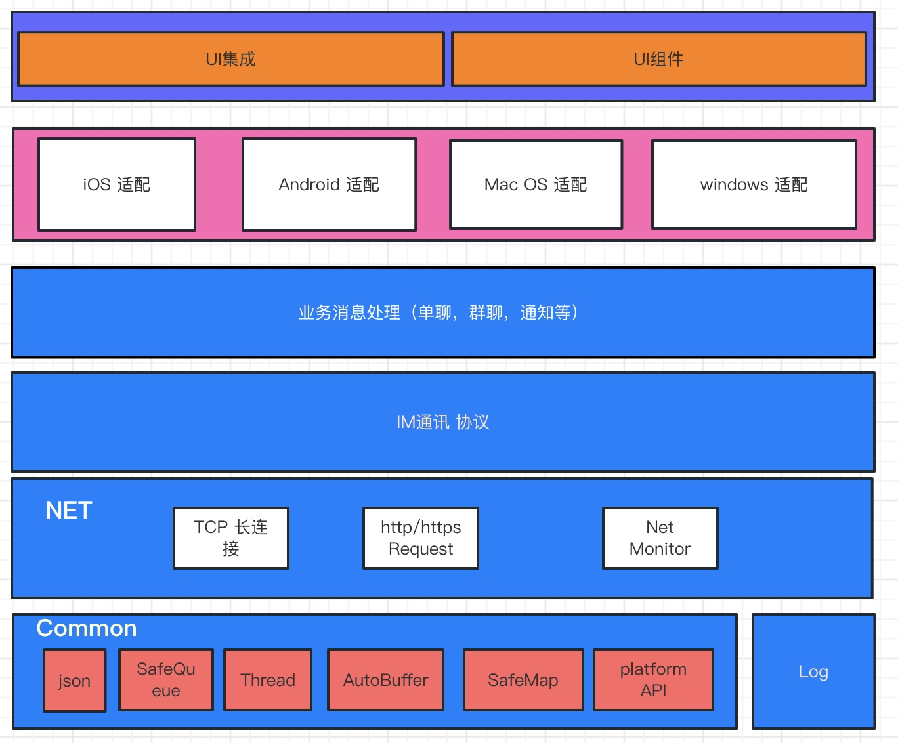

#### 方案实现:
- TCP链接
CTcpSocket
CSSLSocket

- 长链接维护、数据收发
CTNSendRecvThread 

- OMTP数据报文处理
CTNProcessThread


- 日志记录
CLog

- SDK对外接口及回调接口
ITnImSdkCallback
```cpp
  /**
     * OMTP回调接口
     */
    class ITnImSdkCallback
    {
    public:
        virtual ~ITnImSdkCallback(){}
        
    
        virtual void netStatusChanged(int32_t status) = 0;
   
        virtual void loginResp(int32_t code, const std::string &clientId) = 0;
    
   
        virtual void kickOut() = 0;
   
        virtual void hotSessionResp(otim::HotSessionResp* hotSessions) = 0;
     
        virtual void msgRecv(int type, const std::string &packId, otim::MsgReq* req) = 0;
   
        virtual void msgAck(const std::string &packId, otim::MsgAck* ack) = 0;     
    };
    
    class ITnImSdk
    {
    public:
        virtual ~ITnImSdk(){}
        
        /**
         * 增加IM 服务器ip地址和端口
         * @param host ip地址
         * @param port 端口
         * @param isSSL 是否支持ssl连接
         */
        virtual void addHostInfo(const std::string&  host, int32_t port, bool isSSL) = 0;
        
        /**
         * 设置SDK 回调指针
         * @param callback 回调接口指针
         */
        virtual void setCallback(ITnImSdkCallback* callback) = 0;
        /**
         * 登录
         * @param name 用户名，可以不填写
         * @param password 密码，必须填写token
         */
        virtual int32_t login (const std::string&  name, const std::string&  password) = 0;
        /**
         * 登出
         * @param notifyServer 是否向server发送数据报文
         */
        virtual int32_t logout (bool notifyServer) = 0;
        /**
         * 发送消息
         * @param message 消息体
         */

        virtual int32_t sendMessage(int type, otim::MsgReq& req) = 0;

        /**
         * 获取网络状态
         */
        virtual int32_t getNetStatus() = 0;
        
        //获取当前clientId
        virtual std::string getClientId() = 0;
        
        /**
            * 请求用户信息
            * @param userIds 用户Id列表
            */
        virtual void reqUserinfosFromServer(std::vector<std::string> userIds) = 0;
        
     };
    
    
    /**
     * 日志记录接口
     */
    class ITnIMLog{
    public:
        virtual ~ITnIMLog(){}

        /**
         * 写日志
         * @param logs 日志内容
         */
        virtual void writeLog(const std::string& logs) = 0;
        
        /**
         * 获取日志文件名称及路径
         * @return 日志文件路径及名称 外部必须释放 返回字符串内存
         */
        virtual const std::string& getLogFileName() = 0;
        
    };
    
    /**
     * 初始化日志模块
     * @param appPath 日志保存路径
     */
    void initLog(const std::string& appPath);
    /**
     * 获取日志接口实例，调用此接口前必须调用 initLog
     */
    ITnIMLog* getLogInstance();
    
    /**
     * 初始化IM 模块
     * @param clientInfo IM 所需要的参数
     */
    ITnImSdk* initIm(TNClientInfo &clientInfo);
    
  
    /**
     * 获取IMSDK IM模块实例
     * 调用此函数前必须调用 initIm接口
     */
    ITnImSdk* getImSDK();

}

```


### 源码说明
#### 源码地址
https://github.com/lanhy/otim.git

#### 目录说明
- doc 
    - 文档目录，目前有两个文档著作
    - 《基于Tars高并发IM系统的设计与实现》
    - 《OMTP协议说明文档》
- client 
    - 客户端SDK及示例代码
- server 
    - 服务端代码，基于Tars微服务架构的IM系统相关子服务；
- test 
    - 自动测试代码;

#### 服务端源码结构
- BrokerServer	
    接入服务	
- HttpServer
    开放平台及接口服务		
- AuthServer	
    认证服务	
- GroupChatServer	
    群聊服务
- PushServer
    离线push服务
- BizMsgServer	
    业务通知消息服务	
- HistoryMsgServer	
    离线(历史)消息服务
- SingleChatServer
    单聊服务
- UserFriendServer
    用户好友服务开放平台及接口服务
- MsgOperatorServer	
    消息操作服务
- OlapServer	
    Mysql冷存储服务	
- third
    第三方库
- Common		
    公共模块	
- CommonTars	
    OMTP协议Tars文件	
    
#### 客户端SDK源码结构
- lib	
    第三方库	
- source
    客户端SDK代码
- TestSDK	
    SDK调用实例		


